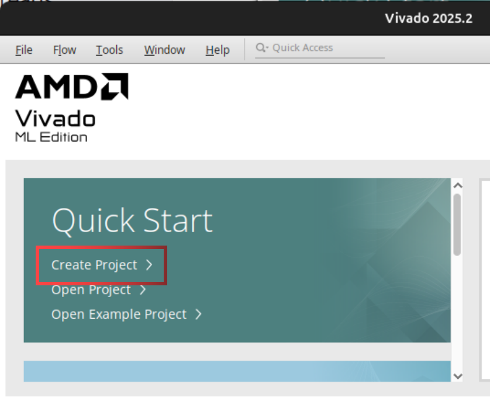
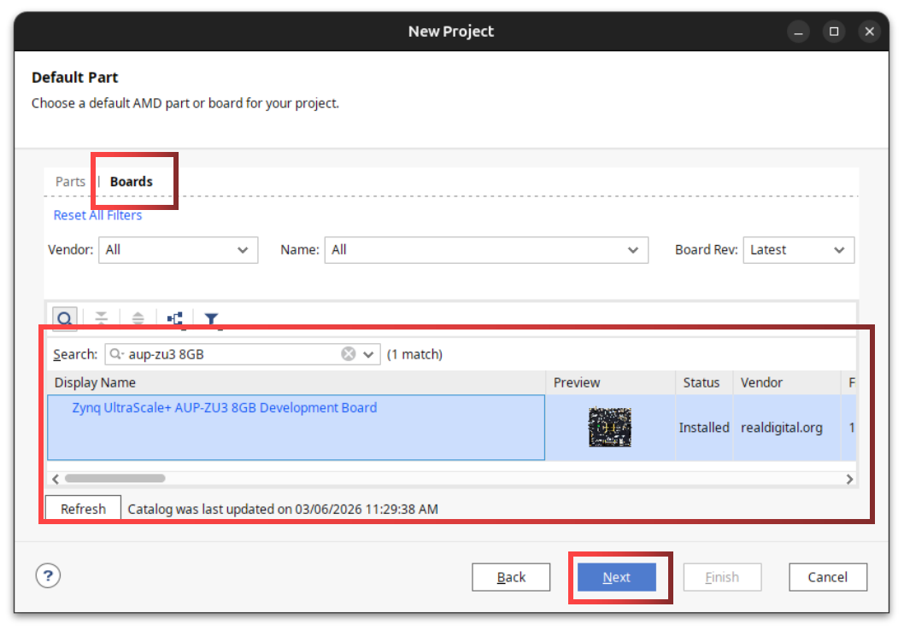
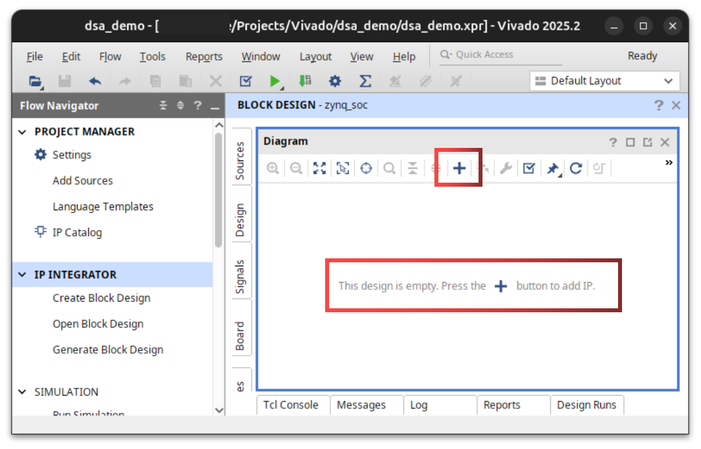
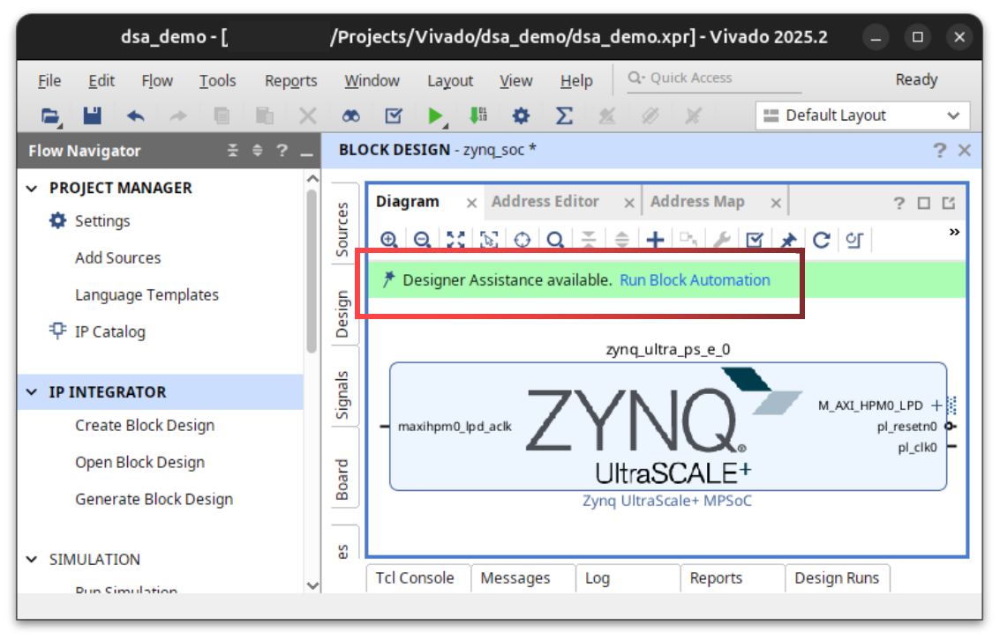
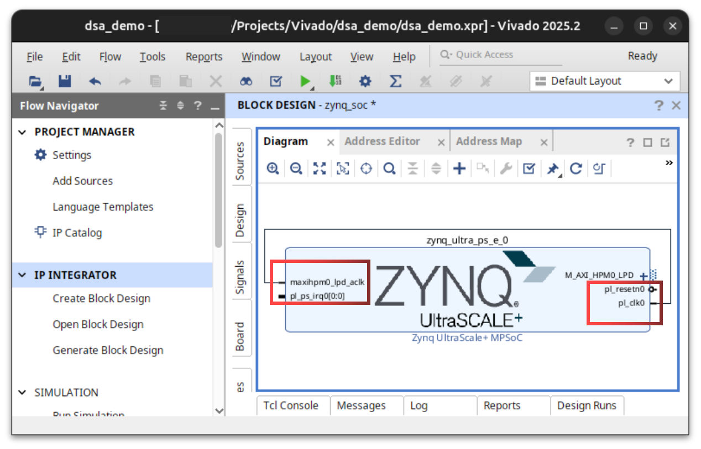

# Lab 1: Hello Zynq

## Description

In this lab, you will learn how to build a simple System on Chip (SoC) using the Xilinx Vivado design suite. The SoC will be built around the Zynq UltraScale+ MPSoC, which is a powerful System on Chip that contains both an FPGA fabric and a quad-core ARM Cortex-A53 processor. You will learn how to create the minimum hardware design necessary to run a simple "Hello World" application on the ARM processor, and how to use the AMD Vivado and Vitis SDK.

## Lab Objectives

1. Create a simple Zynq Processing System (PS) design in Vivado
2. Generate the necessary hardware files for software development
3. Create a simple "Hello Zynq" application in Vitis SDK
4. Run the application on the ARM processor

## Before You Start

{: .note }
> Before you open Vivado, you will need to install the AUP-ZU3 board files. These files contain the necessary information for Vivado to recognize the AUP-ZU3 board and its components, such as the FPGA, ARM processor, and peripherals. Without these files, you will not be able to create a hardware design for the AUP-ZU3 board in Vivado.
> 
> 1. Download the AUP-ZU3 board files from the following link: [AUP-ZU3 Board Files](https://www.github.com/RealDigitalOrg/aup-zu3-bsp)
> 2. Extract the downloaded files to a location on your computer where you can easily access them.
> 3. Copy the extracted `board_files` folder to the following directory: `{VITIS_INSTALL_ROOT}\Vivado\2025.2\data\boards\`. For example, if you installed Vivado in `C:\Xilinx\Vivado\2025.2`, you would copy the `board_files` folder to `C:\Xilinx\Vivado\2025.2\data\boards\`.

## Directions

### Vivado Design

1. **Open Vivado and create a new project.**
    1. 
    2. Name your project e.g. "lab1" and select a location to save your project. Click "Next".
    3. In the "Project Type" section, select "RTL Project", "Do not specify sources", and click "Next".
    4. In the "Default Part" section, select "Boards" and search for "AUP-ZU3 8GB". Select the "AUP-ZU3" board and click "Next", then "Finish". 
2. **Create a new block design.**
    1. In the Flow Navigator, click on "Create Block Design" under the "IP Integrator" section. Name your block design e.g. "zynq_soc" and click "OK".
3. **Add the Zynq UltraScale+ MPSoC IP to your block design.**
    1. In the block design canvas, click on "Add IP" and search for "Zynq UltraScale+ MPSoC". Select the "Zynq UltraScale+ MPSoC" IP and click "Add IP". 
    2. 
    3. You should now see the Zynq UltraScale+ MPSoC IP block in your block design canvas. This block represents the processing system (PS) of the Zynq SoC, which contains the ARM Cortex-A53 processor and various peripherals.
    4. Use the "Run Block Automation" feature to automatically configure board specific settings for the Zynq UltraScale+ MPSoC IP. Select "Apply Board Preset" and choose "AUP-ZU3-8GB". Click "OK" to apply the preset. This will set up the necessary connections and configurations for the AUP-ZU3 board. 
4. **Connecting the PL Clock**
    1. The Zynq UltraScale+ MPSoC has a dedicated clock output that can be used to drive the programmable logic (PL) fabric. This clock is typically connected to the PL fabric through a clock wizard or directly to the PL clock input.
    2. In your block design, you should see a clock output from the Zynq UltraScale+ MPSoC block labeled "pl\_clk0". This is the clock output from the Zynq PS that can be used to drive the PL fabric logic. We'll use this clock in future labs to drive the logic in the PL fabric.
    3. For now, use your mouse to click and drag from the "pl\_clk0" output pin (right side) on the Zynq UltraScale+ MPSoC block to the "maxihpm0\_lpd\_aclk" input pin (left) on the Zynq UltraScale+ MPSoC block. This will create a connection between the PS clock output and the PL clock input. This connection is necessary for the PS to be able to drive logic in AXI interfaces between the PS and PL. 
5. **Validate your block design.**
    1. Click on the "Validate Design" button (checkmark icon) to check for any errors in your block design. If there are any errors, Vivado will provide feedback on what needs to be fixed. Make sure to resolve any errors before proceeding.
6. **Generate an HDL wrapper for your block design.**
    1. In the "Sources" panel, right-click on your block design `Design Sources > zynq_soc (zynq_soc.bd)` and select "Create HDL Wrapper".
    2. Select "Let Vivado manage wrapper and auto-update".
    3. Click "OK" to close the "Generate HDL Wrapper" window.
7. **Generate the bitstream:**
    1. In the "Flow Navigator" panel, click on "Generate Bitstream".
    2. Click "OK" to generate the bitstream. Watch the progress in the top-right corner of the Vivado window.
    3. Once the bitstream is generated, you will be asked to "Open Implemented Design", close this window.
8. **Export your project:**
    1. Open Vivado and select `File > Export > Export Hardware`.
    2. Check the box that says "Include bitstream" and click "Finish".

### Vitis SDK

1. **Create a workspace for your Vitis SDK project.**
    - On your computer, create a new folder to serve as your workspace for Vitis SDK projects. For example, you could create a folder called "labs" in your project directory.
2. **Open Vitis SDK and create a new platform component.**
    1. On the welcome page in Vitis, select `New Platform Component` under **Embedded Development**.
    2. **Plaform Name:** E.g. "lab1_bsp". _NB: "_bsp" stands for "Board Support Package", this is a common naming convention for platform projects in Vitis SDK._
    3. **Platform Location:** Select the workspace folder you created earlier. E.g. `[project directory]/labs`.
    4. Click "Next" to select a hardware design (XSA).
    5. **Select Hardware:**
        1. Click "Browse" and navigate to your project directory.
        2. Select the `zynq_soc_wrapper.xsa` file". This file is generated by Vivado when you export your hardware design, and it contains all the necessary information about the hardware design for Vitis SDK to create a platform. Yours may be named differently depending on the name of your block design, but it should be in the same directory as your Vivado project and have a `.xsa` extension.
        3. Click "Next" to select an operating system.
    6. **Select OS Platform:**
        1. **Operating System:** Select "standalone". This means we will be running a simple application without an operating system, directly on the hardware.
        2. **Processor:** Select "psu\_cortexa53\_0". This is the ARM Cortex-A53 processor in the Zynq PS that we will be using to run our application.
        3. **Architecture:** 64-bit.
        3. Click "Next" to view a summary of the platform.
        4. Click "Finish" to create the platform. Your platform should now be visible under "Vitis Components" in the left panel.
        5. Wait for Vitis SDK to finish creating the platform. This may take a few minutes as it processes the hardware design and generates the device tree, peripheral drivers, and board configurations.
3. **Create a new application project.**
    1. In the application menu, select `File > New Component > Application`.
    2. **Component Name:** E.g. "lab1".
    3. **Component Location:** Select the workspace folder you created earlier.
    4. Click "Next" to select a target hardware.
    5. **Select Platform:**
        1. **Platform:** Select the platform you created earlier (e.g. "lab1\_bsp (aup-zu3-8gb)").
        2. Click "Next" to select an application domain.
    6. **Select Domain:**
        1. **Name:** Select "standalone\_psu\_cortexa53\_0". This domain corresponds to the standalone operating system running on the ARM Cortex-A53 processor in the Zynq PS. In our case, "standalone" means we will be running a simple application without an operating system, directly on the hardware, "bare metal".
        2. Click "Next" to view the application summary and finish.
        3. You should now see your application under "Vitis Components" in the left panel.
        4. Wait for Vitis SDK to finish creating the application. This may take a few minutes as it sets up the project structure and generates necessary files.
4. **Writing the Application:**
    1. Under "Vitis Components", find your application and navigate to `Sources > src`.
    2. Right-click on the `src` folder and select `New File`.
    3. Enter a file name, e.g. "lab1.cpp", and click "OK". _NB: You can use either C or C++ for your application, the file extension you use will determine the compiler used on your project (.c for C, .cpp for C++)._
    4. Use the following code snippet to get started with your application:
        ```c
        #include <iostream>
        
        int main(void) {
          // Print "Hello Zynq!" to the console.
        
          return 0;
        }
        ```
5. **Building and Running the Application:**
    1. In the top menu, select `Vitis > Serial Monitor`, use baudrate `115200`. The serial monitor window will open in the bottom panel.
    2. Under "Vitis Components", select your application, then in the "Flow" panel, click "Build".
    3. Once the build is complete, click "Run" to program the FPGA and run your application.
    4. If everything is set up correctly, you should see "Hello Zynq!" printed in the serial monitor.

{: .new-title }
> Congratulations!
>
> You've successfully built and run your first application on the Zynq SoC! In future labs, we will build more complex hardware designs and applications, but this is the foundation for everything we will do in this course.

## Next Steps

In the next lab, we will implement an example compute intensive application on the ARM processor and CPU optimization techniques, and benchmarking the performance of our application. 

## Troubleshooting

If you encounter any issues during this lab, here are some common troubleshooting steps:
1. If your platform is not available in Vitis after you created it, you may have to delete your workspace and start over. My Vitis has been glitching on new workspaces.
2. If you are having trouble with the serial monitor, make sure you have the correct COM port selected and that your baudrate is set to 115200.
