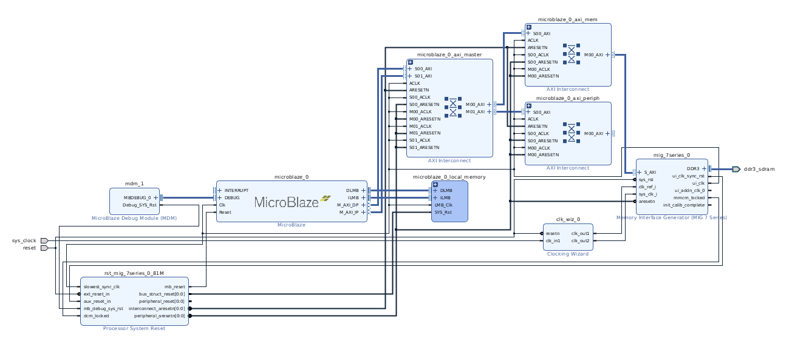
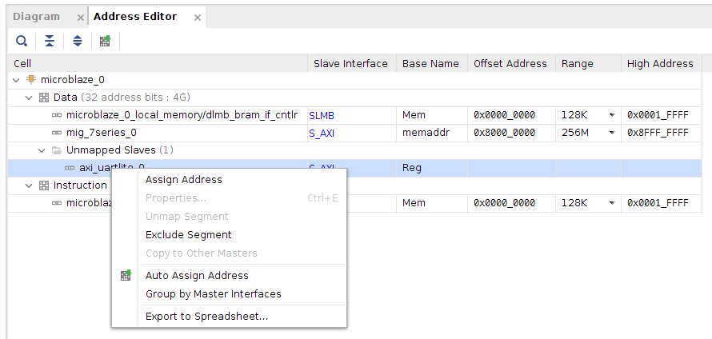

# Lab 1: Building A Basic SoC

## Description

In laboratory 1 you will complete a provided boilerplate design of a [System-on-Chip (SoC)](https://en.wikipedia.org/wiki/System_on_a_chip) using the Xilinx-Vivado development suite and targeted at the [Arty-A7-35](https://www.xilinx.com/products/boards-and-kits/1-elhaap.html) development board. Your design will contain a MicroBlaze soft processor, a USB UART serial controller, and a DDR memory controller that interfaces with components on the Arty board. The processor will be connected to the serial port and DDR memory peripherals in a shared-bus architecture. You will then program this SoC using the C programming language to print out your name and student ID five times to the screen of a desktop computer which is connected to the Arty-7 development board using the USB serial port. There will be 2 screenshot requirements for your report, so ensure you read the following instructions carefully.

## Project Assignment

Use the provided base project to create a basic system-on-chip and add a UART serial controller to your SoC. Synthesize your system-on-chip, compile your software project, combine them into a bitstream, and download it onto the Arty-A7-35 development board. Create a software project and make it print out your name five times.

This may not seem like much, but at the end of this laboratory, you will have created a system-on-chip and executed a program on top of it in a bare metal environment. This represents a rudimentary but fully functional embedded system.

## Directions

{: .highlight}
> __Preamble - Adding Arty board to Vivado:__
>
> Before opening Vivado, visit [Digilent's website](https://digilent.com/reference/programmable-logic/guides/installing-vivado-and-vitis) and follow the instructions listed under __"Install Digilent's Board Files"__. The instructions will provide you with a [download link](https://github.com/Digilent/vivado-boards/archive/master.zip) for the board files. When you extract the archive, you only need to install the "arty-a7-35" directory, other boards are not necessary for our purposes.  

__Vivado - Generating a bitstream:__

1. Start by downloading the base [SoC project from GitHub](https://github.com/tkamucheka/eecs-4114-labs).
    * ___NB:__ Windows users - Extract the downloaded files to a directory close to your system root directory. E.g. `C:\Users\[username]\Desktop\eecs-4114-labs`. Visit [this page](https://learn.microsoft.com/en-us/windows/win32/fileio/maximum-file-path-limitation?tabs=registry) for Windows path character limit details._
2. Open the downloaded project in Vivado 2019.1.
    * __Option 1:__ In the project folder (e.g. `C:\Users\[username]\Desktop\eecs-4114-labs\base-soc`), double-click the file __base-soc.xpr__
    * __Option 2:__ Start by opening Vivado 2019.1. On the welcome screen, select "Open Project". Use the dialog to navigate to your project directory, and open the __base-soc.xpr__ file.
3. In the left panel, "Flow Navigator", select the "Open Block Design" option. 
    __PDF Version:__ [Block Design](./assets/datasheets/base_soc.pdf){: target="_blank"}
4. Add the __AXI UARTlite__ soft-ip core to the design.
    1. Right-click anywhere in the board design window and select "__+ Add IP...__".
    2. Enter "Uartlite" in the search window and double-click on the "AXI Uartlite" option. The AXI Uartlite soft-ip core should appear in the block design along with a green bar at the top of the window.
    3. In the green bar, select "Run Connection Automation". Then, in the "Run Connection Automation" window, check the "UART" checkbox under "__axi_uartlite..__" and click "OK".
    ___Important:__ leave the __S_AXI__ box unchecked._
    4. Almost there... Right-click the __S_AXI__ port on the AXI Uartlite core and select "Make Connection...". In the "Make Connection" window, select the __M00_AXI__ under __microblaze_0_axi_periph__ and click "OK" to make the connection.
    5. Finally, select "Run Connection Automation" again. Select __s_axi_clk__ under __axi_uartlite..__ and change the "Clock Source:" option to `/mig_7series_0/ui_clk (81 MHz)`. Click "OK" to automate the connection of the clock and reset ports.
    6. You may need to assign an address to the AXI Uartlite soft-ip. Open the "Address Editor" window and verify that an address has been assigned to "axi_uartlite..". If not, right-click on __"axi_uartlite.."__ and select "Auto Assign Address". 
5. In the "Sources" window, right-click on the "base_soc.bd" file and select "Create HDL Wrapper...". The "base_soc.bd" file should now be nested inside "base_soc_wrapper.v" file.
6. Back in the "Flow Navigator" window, select "Generate Bitstream" to synthesize your design. This may take a while...
7. After generating a bitstream, select `File > Export > Export Hardware` in the top menu. Then in the export window, select the "Include bitstream" option before exporting your design.

__SDK - Creating Software Project:__

1. To open the SDK environment, select `File > Launch SDK` in the top menu.
2. In the SDK, select `File > New > Application Project`.
    1. Start by entering a name for your project. E.g. "lab1"
    2. __OS Platform:__ should be set to "standalone"
    3. __Hardware Platform:__ default setting, "soc_wrapper_hw_platform_0"
    4. __Processor:__ default setting, "microblaze_0"
    5. __Language:__ C
    6. __Board Support Package:__ Create New - e.g. "lab1_bsp"
    7. Select "Next" to open the application templates page.
3. Select the "Hello World" template, and click "Finish" to create your application project.
4. In the "Project Explorer" window, open the file `lab1/src/helloworld.c`
5. Edit this program to print your name and student ID 5 times.
6. __Pause!__{: .label .label-red} Now is a good time to make sure your FPGA dev board is plugged in.
7. Combine your hardware design and application project into a single bitstream and load it onto your FPGA board.
    1. Start by selecting `Xilinx > Program FPGA` in the top menu. Nothing to change on this window, select "Program" to load the bitstream onto the FPGA.
8. Establish a serial connection with the FPGA's serial port.
    1. Open the "SDK Terminal" window. It will be in the bottom-center panel.
    2. Click on the plus icon to open the "Connect to serial port" dialog.
    3. __Port:__ Select a COM port from the dropdown list. If there is more than one option, the COM port with the highest numerical suffix is usually the correct option.
    4. __Baud Rate:__ 9600
    5. __Data bits:__ 8
    6. __Stop bits:__ 1
    7. __Parity:__ None
    8. __Flow Control:__ None
    9. Click "OK" to start the connection.
9. Run your application!
    1. Right-click on your project (e.g. lab1) in the "Project Explorer" window and select `Run > Run As > Launch On Hardware (System Debugger)`.
    2. Alternatively, select `Run > Run As > Launch On Hardware (System Debugger)` to launch the application in debug mode where you will have the option to step through the program and view memory/register contents interactively. Use this option when debugging your applications.

## Submission

1. Prepare a lab report: (Use the lab report template provided)
    * Give an account of what you did in this lab, what you learned, and anything you found interesting.
    * Include the screenshots of your __Uartlite__ controller and neighboring components and the output of your "SDK Terminal" window.
    * Include essential relevant screenshots, diagrams, and code snippets necessary to your writing in the report.  
2. Submit, separately, all your code files (e.g. the "helloworld.c" file).
    * ___NB: DO NOT__ paste your code in your lab report._

## Prelab Assignment

1. What is an FPGA?
2. What is a system-on-chip? Why is it different from your desktop computer system?
3. What does soft-core IP mean?
4. What does it mean to cross-compile a program?
5. Why does it take so long to configure/build the Hardware portion of your system on the FPGA?
6. How does the desktop computer program the FPGA, how does it monitor the FPGA?
