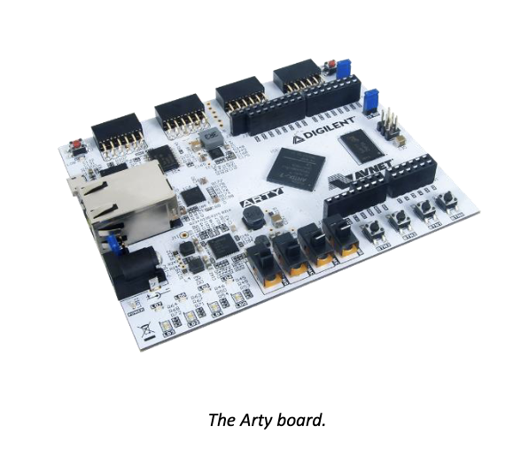
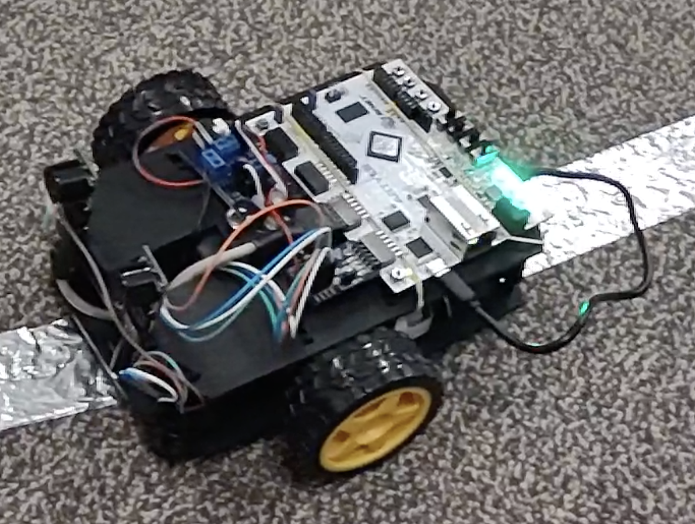

# EECS 41104/51104 Embedded Systems

| Arty-A7 Protoboard                       | Autonomous Vehicle                     |
| ---------------------------------------- | -------------------------------------- |
|  |  |

## Course Description

The design and analysis of modern HW/SW co-designed embedded systems. Modern design flows and approaches for creating and controlling System on Chip integrated components. Real time and reactive modeling and implementation of control loops and data processing. System level integration techniques for multiprocessor components and accelerators.

This class will make use of the Xilinx/Digilent [Arty-A7-100](https://www.xilinx.com/products/boards-and-kits/1-w51quh.html) Development Board. This development board contains a modern Artix 7-series FPGA along with various peripherals such as Ethernet, USB, Audio In/Out, LEDs, buttons, switches, VGA, etc. Various System-On-Chip (SoC) architectures will be developed during this class, all of which will be implemented within the fabric of the FPGA. Most, if not all, of the SoCs developed during this class will use the MicroBlaze processor; a soft 32-bit processor core developed by Xilinx. The instruction set architecture, or ISA, of the MicroBlaze will be studied and used throughout this class, in order to teach students the relationships between high-level languages, assembly language, and the actual hardware implementation of computer systems.

## Syllabus

Course syllabus can found here: [Syllabus](./syllabus.md)

## Textbook

[EECS 4114: Embedded Systems](https://learn.zybooks.com), Frank Vahid, Tony Givargis, Bailey Miller, Zybooks

## Schedule

All lectures can be found through the following link: [EECS 4114 Lecture Page](./schedule.md).

## Lab Repository

All lab projects can be found through the following link: [EECS 4114 Lab Page](./labs).

## Course Archive

- [Spring 2023](./archive/spring-2023)
