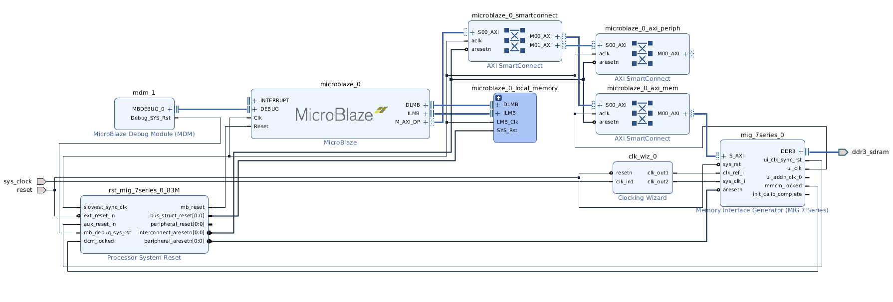

# Lab 1: Building A Basic SoC

## Description

In laboratory 1 you will complete a provided boilerplate design of a [System-on-Chip (SoC)](https://en.wikipedia.org/wiki/System_on_a_chip) using the Xilinx-Vivado development suite and targeted at the [Arty-A7-35](https://www.xilinx.com/products/boards-and-kits/1-elhaap.html) development board. Your design will contain a MicroBlaze soft-processor, a USB UART serial controller, and a DDR memory controller that interface with components on the Arty board. The processor will be connected to the serial port and DDR memory peripherals in a shared-bus architecture. You will then program this SoC using the C programming language to print out your name and student ID five times to the screen of a desktop computer which is connected to the Arty-7 development board using the USB serial port. There will be 3 screenshot requirements for your report, so ensure you read the following instructions carefully.

## Project Assignment

Use the provided base project to create a basic system-on-chip and add a UART serial controller to your SoC. Synthesize your system-on-chip, compile your software project, combine them into a bitstream, and download your bitstream onto the Arty-A7-35 development board. Create a software project and make it print out your name five times.

This may not seem like much, but at the end of this laboratory you will have created a system-on-chip and executed a program on top of it in a bare metal environment. This represents a very basic but fully functional embedded system.

## Directions

**Vivado - Generating a bitstream:**

1. Start by downloading the base [SoC project from GitHub](https://github.com/tkamucheka/eecs-4114-labs).
    * _**NB:** Windows users - Extract the downloaded files to a directory close to your system root directory. E.g. `C:\eecs-4114-labs`. Visit [this page](https://learn.microsoft.com/en-us/windows/win32/fileio/maximum-file-path-limitation?tabs=registry) for details on Windows path character limit._
2. Open the downloaded project in Vivado 2019.1.
    * **Option 1:** In the project folder (e.g. `C:\eecs-4114-labs\base-soc`), double-click the file **base-soc.xpr**
    * **Option 2:** Start by opening Vivado 2019.1 On the welcome screen, select "Open Project". Use the dialog to navigate to your project directory, and open the **base-soc.xpr** file.
3. In the left panel, "Flow Navigator", select the "Open Block Design" option. 
4. Add the AXI UARTlite soft-ip core to the design.
    1. Right-click anywhere in the board design window and select "**+ Add IP...**".
    2. Enter "Uartlite" in the search window and double-click on the "AXI Uartlite" option. The AXI Uartlite soft-ip core should appear in the block design along with a green bar at the top of the window.
    3. In the green bar, select "Run Connection Automation". Then in the "Run Connection Automation" window, check the "UART" checkbox under "**axi_uartlite..**". _**Important:** leave the S_AXI box unchecked._
    4. Almost there... Right-click the **S_AXI** port on the AXI Uartlite core and select "Make Connection...". In the "Make Connection" window, select the **M00_AXI** under **microblaze_0_axi_periph**.
    5. Finally, select "Run Connection Automation" again. Select **s_axi_clk** under **axi_uartlite..** and change the "Clock Source:" option to **`/mig_7series_0/ui_clk (83 MHz)`**. Do the same thing for **M00_ACLK** under **microblaze_0_axi_periph**.
5. In the "Sources" window, right-click on the "base-soc.bd" file and select "Create HDL Wrapper...". The "base_soc.bd" file should now be nested inside "base_soc_wrapper.v" file.
6. Back in the "Flow Navigator" window, select "Generate Bitstream" to synthesize your design. This may take a while.
7. After generating a bitstream, select "File > Export > Export Hardware" in the top menu. Then in the export window, select the "Include bitstream" option before exporting your design.

**SDK - Creating Software Project:**

1. To open the SDK environment, select "File > Launch SDK" in the top menu.
2. In the SDK, select "File > New > Application Project".
    1. Start by entering a name for your project. E.g. "lab1"
    2. **OS Platform:** should be set to "standalone"
    3. **Hardware Platform:** default setting, "soc_wrapper_hw_platform_0"
    4. **Processor:** default setting, microblaze_0
    5. **Language:** C
    6. **Board Support Package:** Create New - e.g. "lab1_bsp"
    7. Select "Next" to open the application templates page.
3. Select the "Hello World" template, and click "Finish" to create your application project.
4. In the "Project Explorer" window, open the file `lab1/src/helloworld.c`
5. Edit this program to print your name and student ID 5 times.
6. **Pause!** Now is a good time to make sure your FPGA dev board is plugged in.
7. Establish a serial connection with the FPGA's serial port.
    1. Open the "SDK Terminal" window. It will be in the bottom-center panel.
    2. Click on the plus icon to open the "Connect to serial port" dialog.
    3. **Port:** Select a COM port from the dropdown list. If there is more than one option, the COM port with the highest numerical suffix is usually the correct option.
    4. **Baud Rate:** 9600
    5. **Data bits:** 8
    6. **Stop bits:** 1
    7. **Parity:** None
    8. **Flow Control:** None
    9. Click "OK" to start the connection.
8. Combine your hardware design and application project into a single bitstream and load it onto your FPGA board.
    1. Start by selecting "Xilinx > Program FPGA" in the top menu. Nothing to change on this window, select "Program" to load the bitstream onto the FPGA.
    2. Next, select "Run > Run As > Launch On Hardware (System Debugger)"
    3. Alternatively, select "Launch On Hardware (GDB)" to launch the application in debug mode where you will have the option to step through the program. Use this option when debugging your applications.

## Prelab Questions

1. What is an FPGA?
2. What is a system-on-chip? Why is it different from your desktop computer system?
3. What does soft-core IP mean?
4. What does it mean to cross-compile a program?
5. Why does it take so long to configure/build the Hardware portion of your system on the FPGA?
6. How does the desktop computer program the FPGA, how does it monitor the FPGA?
