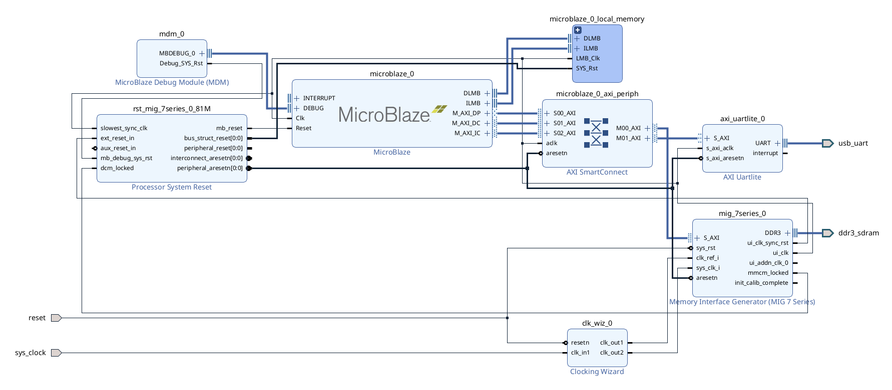

# Lab 1: Building A Basic SoC

## Description

In lab 1 you will complete a provided boilerplate design of a [System-on-Chip (SoC)](https://en.wikipedia.org/wiki/System_on_a_chip) using the Xilinx-Vivado development suite and targeted at the [Arty-A7-100](https://www.xilinx.com/products/boards-and-kits/1-w51quh.html) development board. Your design will contain a MicroBlaze soft processor, a USB UART serial controller, and a DDR memory controller that interfaces with components on the Arty board. The processor will be connected to the serial port and DDR memory peripherals in a shared-bus architecture. You will then program this SoC using the C programming language to print out your name and student ID five times to the screen of a desktop computer which is connected to the Arty-7 development board using the USB serial port. There will be 2 screenshot requirements for your report, so ensure you read the following instructions carefully.

## Project Assignment

Use the provided base project to create a basic system-on-chip and add a UART serial controller to your SoC. Synthesize your system-on-chip, compile your software project, combine them into a bitstream, and download it onto the Arty-A7-100 development board. Create a software project and make it print out your name five times.

This may not seem like much, but at the end of this laboratory, you will have created a system-on-chip and executed a program on top of it in a bare metal environment. This represents a rudimentary but fully functional embedded system.

## Directions

{: .important}
> __Preamble - Adding Arty board to Vivado:__
>
> Before opening Vivado, visit [Digilent's website](https://digilent.com/reference/programmable-logic/guides/installing-vivado-and-vitis) and follow the instructions listed under __"Install Digilent's Board Files"__. The instructions will provide you with a [download link](https://github.com/Digilent/vivado-boards/archive/master.zip) for the board files. When you extract the archive, you only need to install the "arty-a7-100" directory, other boards are not necessary for our purposes.  

__Vivado - Generating a bitstream:__

{: .note}
> - I'll walk you through the process of creating a block design of your SoC, and generating a bitstream.
> - If you have any questions, please ask for help.
> - If you're using a different version of Vivado, the steps may vary slightly. Just let me know.

|  |
|:--:|
| *SoC Block Design* |

1. **Export your project:**
    1. Open Vivado and select `File > Export > Export Hardware`.
    2. Check the box that says "Include bitstream" and click "Finish".

__Vitis IDE - Creating Software Project:__

1. To open Vitis IDE, select `Tools > Launch Vitis IDE` in the top menu.
2. On the welcome page in Vitis, select `Create Platform Component` under **Embedded Development**.
    1. **Plaform Name:** E.g. "lab1_platform"
    2. **Platform Location:** In the project directory create a new folder that will be used as your project workspace. E.g. `[project directory]/labs`.
    2. Click "Next" to select a hardware design (XSA).
3. **Select Hardware:** 
    1. Click "Browse" and navigate to your project directory.
    2. Select the `base_soc_wrapper.xsa` file".
    3. Click "Next" to select an operating system.
4. **Select OS Platform:**
    1. **Operating System:** Select "standalone".
    2. **Processor:** Select "microblaze_0".
    3. Click "Next" to view a summary of the platform.
    4. Click "Finish" to create the platform. Your platform should now be visible under "Vitis Components" in the left panel.
5. Now let's create a new application to run on the platform.
    1. In the application menu, select `File > New Component > Application`.
6. **Name and Location:**
    1. **Component Name:** E.g. "lab1".
    2. **Component Location:** Select the workspace folder you created earlier.
    3. Click "Next" to select a target hardware.
7. **Select Platform:**
    1. **Platform:** Select the platform you created earlier.
    2. Click "Next" to select an application domain.
8. **Select Domain:**
    1. **Name:** Select "standalone_microblaze_0".
    2. Click "Next" to view the application summary and finish.
    3. You should now see your application under "Vitis Components" in the left panel.
9. **Writing the Application:**
    1. Under "Vitis Components", find your application and navigate to `Sources > src`.
    2. Right-click on the `src` folder and select `New File`.
    3. Enter a file name, e.g. "lab1.c", and click "OK".
    4. Use the following code snippet to get started with your application:
        ```c
        #include <stdio.h>
        #include "xil_printf.h"

        int main(void) {

            // Your code goes here:
            // Print your name and student ID 5 times

            return 0;
        }
        ```
10. **Building and Running the Application:**
    1. In the top menu, select `Vitis > New Feature Preview`.
    2. Select the "Serial Monitor" and click "Enable". This will allow you to see the output of your program.
    3. In the top menu, select `Vitis > Serial Monitor`. The serial monitor window will open in the bottom panel.
    4. Under "Vitis Components", select your application, then in the "Flow" panel, click "Build".
    5. Once the build is complete, click "Run" to program the FPGA and run your application.

## Submission

{: .note-title}
> Submission Requirements:
>
> **Due Date**: Friday, September 6, 2024
>
> * __DO NOT__ paste your code in your lab report.
> * __DO NOT__ submit your entire project folder or .xsa file.
> * __DO NOT__ submit zip files or any other compressed files.

1. Prepare a lab report: (Use the lab report template provided)
    * Give an account of what you did in this lab, what you learned, and anything you found interesting.
    * Include the screenshots of your block design and the output of your `Vitis > Serial Monitor` or [Putty](https://portableapps.com/apps/internet/putty_portable) window.
    * Include only essential relevant screenshots, diagrams, and code snippets necessary to your writing in the report.  
2. Submit, separately, all your code files (e.g. the "helloworld.c" file).

## Prelab Assignment

1. What is an FPGA?
2. What is a system-on-chip? Why is it different from your desktop computer system?
3. What does soft-core IP mean?
4. What does it mean to cross-compile a program?
5. Why does it take so long to configure/build the Hardware portion of your system on the FPGA?
6. How does the desktop computer program the FPGA, how does it monitor the FPGA?
