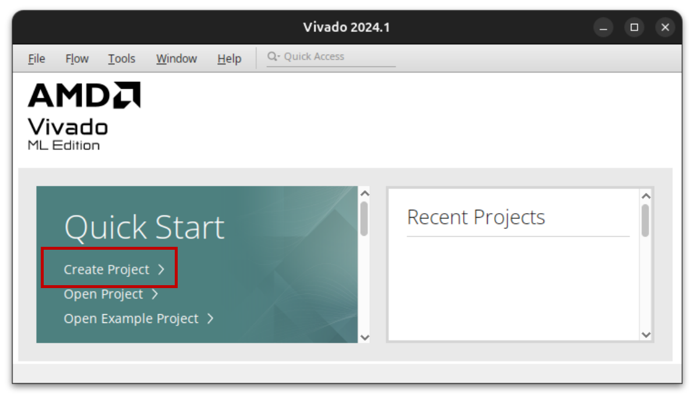
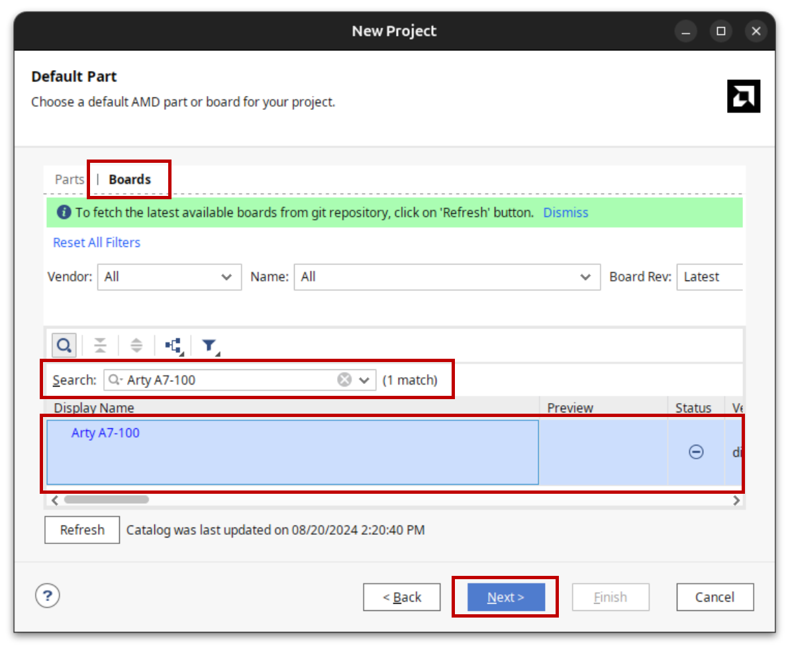

# Lab 1: Building A Basic SoC

## Description

In lab 1 you will complete a provided boilerplate design of a [System-on-Chip (SoC)](https://en.wikipedia.org/wiki/System_on_a_chip) using the Xilinx-Vivado development suite and targeted at the [Arty-A7-100](https://www.xilinx.com/products/boards-and-kits/1-w51quh.html) development board. Your design will contain a MicroBlaze soft processor, a USB UART serial controller, and a DDR memory controller that interfaces with components on the Arty board. The processor will be connected to the serial port and DDR memory peripherals in a shared-bus architecture. You will then program this SoC using the C programming language to print out your name and student ID five times to the screen of a desktop computer which is connected to the Arty-7 development board using the USB serial port. There will be 2 screenshot requirements for your report, so ensure you read the following instructions carefully.

## Project Assignment

Use the provided base project to create a basic system-on-chip and add a UART serial controller to your SoC. Synthesize your system-on-chip, compile your software project, combine them into a bitstream, and download it onto the Arty-A7-100 development board. Create a software project and make it print out your name five times.

This may not seem like much, but at the end of this laboratory, you will have created a system-on-chip and executed a program on top of it in a bare metal environment. This represents a rudimentary but fully functional embedded system.

## Directions

{: .important}
> **Preamble - Adding Arty board to Vivado:**
>
> Before opening Vivado, visit [Digilent's website](https://digilent.com/reference/programmable-logic/guides/installing-vivado-and-vitis) and follow the instructions listed under **"Install Digilent's Board Files"**. The instructions will provide you with a [download link](https://github.com/Digilent/vivado-boards/archive/master.zip) for the board files. When you extract the archive, you only need to install the "arty-a7-100" directory, other boards are not necessary for our purposes.  

### Vivado - Generating a bitstream

{: .note}

> - If you have any questions, please ask for help.
> - If you're using a different version of Vivado, the steps may vary slightly. Just let me know.

1. **Open Vivado and create a new project.**
    1. 
    2. Give your project a name and select a location to save it. Click "Next" to continue to the "Project Type" screen.
    3. Select the "RTL Project" and "Do not specify sources" options and click "Next".
    4. Select the "Arty-A7-100" board and click "Next".
        
    5. Click "Finish" to create the project.
2. **Create a new block design for your SoC.**
    1. In the "Flow Navigator" panel under "IP INTEGRATOR", click "Create Block Design".
    2. Give your block design a name (e.g. "base_soc") and click "OK". This will open the block design window. Remember the name you give your block design, as you will need it later.
3. **Adding a system clock:**
    1. In the "Diagram" panel, right-click and select "Add IP".
    2. Search for "Clocking Wizard" and double-click to add it to your design.
    3. Double-click on the Clocking Wizard block to open the configuration window.
    4. In the "Board" tab, set the following parameters:
        - **CLK_IN1:** `sys clock`
        - **RESET:** `reset`
    5. In the "Output Clocks" tab, set the following parameters:
        - **CLK_OUT1:** `200 MHz`
        - **CLK_OUT2:** `100 MHz`
        - **Reset Type:** `Active Low`
        - **Locked:** `Disable`
    6. Click "OK" to close the configuration window.
    7. You should see a green bar at the top of the block design window. Click on the "Run Connection Automation" option.
    8. Check all the boxes to automate connecting the systems clock and reset and click "OK".
4. **Adding a Memory Interface Generator (MIG):**
    1. In the "Diagram" panel, right-click anywhere in the white space and select "Add IP".
    2. Search for "MIG" and double-click to add it to your design.
    3. Click on the "Run Block Automation" option. Make sure everything is checked in the window that pops up and click "OK". This will automatically configure the MIG for the DDR memory on the Arty board.
    4. Click on the "Run Connection Automation" option.
    5. Set the following parameters in the "Run Connection Automation" window:
        - **clk_ref_i:** Clock Source - `clk_wiz_0/clk_out1 (200 MHz)`
        - **sys_clk_i:** Clock Source - `clk_wiz_0/clk_out2 (100 MHz)`
        - **sys_rst:** Select Board Part Interface: - `reset (System Reset)`
    6. Click "OK" to connect the MIG to the clock and reset signals.
    7. In the "Board" window, right-click on `Arty A7-100 > External Memory Interfaces > DDR3_SDRAM` and select "Auto Connect".
5. **Adding the MicroBlaze processor:**
    1. Start by adding the MicroBlaze processor to your design.
    2. Search for "MicroBlaze" and add it to your design. **DO NOT** select the MicroBlaze V.
    3. Select "Run Block Automation" and set the following parameters:
        - **Preset:** `Real-time`
        - **Local Memory:** `32KB`
        - **Local Memory ECC:** `None`
        - **Debug Module:** `Debug Only`
        - **Peripheral AXI Port:** `Enabled`
        - **Interrupt Controller:** `Disabled`
        - **Clock Connection:** `mig_7series_0/ui_clk (81 MHz)`
    4. Click "OK" to finish configuring the MicroBlaze processor.
    5. If you still have the "Run Block Automation" option available, click on it. 
        - Check the `Keep Classic MicroBlaze` box. This will ensure that the MicroBlaze processor is not upgraded to the RISC-V MicroBlaze V.
    6. Click on the "Run Connection Automation" option.
        - Change the "Master interface" to `/microblaze_0 (Periph)`
        - Click "OK" to connect the MIG to the peripheral interface of the MicroBlaze processor.
    7. Click on the "Run Connection Automation" option again.
        - Check all the boxes to automate connection "M_AXI_DC" (data cache) and "M_AXI_IC" (instruction cache) to the MIG.
        - Click "OK" to connect the MicroBlaze processor to the DDR memory controller.
6. **Adding the UART controller:**
    1. Search for "AXI Uartlite" and add it to your design.
    2. Click on the "Run Connection Automation" option.
    3. Check the "S_AXI" box to automate connection of the UART to the MicroBlaze processor via the "AXI SmartConnect".
    4. Check the "UART" box to automate connection of the UART to the USB interface.
    5. Click "OK" to connect the UART controller to the MicroBlaze processor and USB interface.
7. **Adding design constraints:**
    1. In the "Flow Navigator" panel, click on "Add Sources".
    2. Select "Add or Create Constraints" and click "Next".
    3. Click "Create File" and give your constraints file a name (e.g. "base_soc.xdc").
    4. Click "Finish" to create the constraints file.
    5. In the "Sources" panel, open the constraints file `Constraints > constr_1 > base_soc.xdc` and add the following constraints:

        ```tcl
        ## Fix clock routing conflict between "sys_clock" and "clk_wiz_0/clk_out2":
        ##   We only have one clock (source) pin on the board, which will be 
        ##   used to route the system clock into our design. Therefore, we need
        ##   to instruct Vivado to do the following:
        ##   - Generate `clk_wiz_0/clk_out2` from the system clock, NOT the
        ##     board's clock pin.
        ##   - Route `clk_wiz_0/clk_out2` using one of the dedicated clock routes.
        ##
        ## NOTE:
        ## - Replace `[base_soc]_i` with the name you gave your block design
        ## - Verify your Clocking Wizard is indeed named "clk_wiz_0".
        ## - This workaround is only necessary for our particular configuration
        ##   on the Arty-A7-100 board.

        set_property CLOCK_DEDICATED_ROUTE true [get_nets base_soc_i/clk_wiz_0/inst/clk_out2]
        ```

8. **Generate an HDL wrapper for your design:**
    1. In the "Sources" panel, right-click on your block design `Design Sources > base_soc (base_soc.bd)` and select "Create HDL Wrapper".
    2. Select "Let Vivado manage wrapper and auto-update".
    3. Click "OK" to close the "Generate HDL Wrapper" window.
9. **Generate the bitstream:**
    1. In the "Flow Navigator" panel, click on "Generate Bitstream".
    2. Click "OK" to generate the bitstream. Watch the progress in the top-right corner of the Vivado window.
    3. Once the bitstream is generated, you will be asked to "Open Implemented Design", close this window.
10. **Export your project:**
    1. Open Vivado and select `File > Export > Export Hardware`.
    2. Check the box that says "Include bitstream" and click "Finish".

|  |
|:--:|
| *SoC Block Design* |

### Vitis IDE - Creating Software Project

1. To open Vitis IDE, select `Tools > Launch Vitis IDE` in the top menu.
2. On the welcome page in Vitis, select `Create Platform Component` under **Embedded Development**.
    1. **Plaform Name:** E.g. "lab1_platform"
    2. **Platform Location:** In the project directory create a new folder that will be used as your project workspace. E.g. `[project directory]/labs`.
    3. Click "Next" to select a hardware design (XSA).
3. **Select Hardware:**
    1. Click "Browse" and navigate to your project directory.
    2. Select the `base_soc_wrapper.xsa` file".
    3. Click "Next" to select an operating system.
4. **Select OS Platform:**
    1. **Operating System:** Select "standalone".
    2. **Processor:** Select "microblaze_0".
    3. Click "Next" to view a summary of the platform.
    4. Click "Finish" to create the platform. Your platform should now be visible under "Vitis Components" in the left panel.
5. Now let's create a new application to run on the platform.
    1. In the application menu, select `File > New Component > Application`.
6. **Name and Location:**
    1. **Component Name:** E.g. "lab1".
    2. **Component Location:** Select the workspace folder you created earlier.
    3. Click "Next" to select a target hardware.
7. **Select Platform:**
    1. **Platform:** Select the platform you created earlier.
    2. Click "Next" to select an application domain.
8. **Select Domain:**
    1. **Name:** Select "standalone_microblaze_0".
    2. Click "Next" to view the application summary and finish.
    3. You should now see your application under "Vitis Components" in the left panel.
9. **Writing the Application:**
    1. Under "Vitis Components", find your application and navigate to `Sources > src`.
    2. Right-click on the `src` folder and select `New File`.
    3. Enter a file name, e.g. "lab1.c", and click "OK".
    4. Use the following code snippet to get started with your application:

        ```c
        #include "stdio.h"
        #include "xil_printf.h"

        int main(void) {

            // Your code goes here:
            // Print your name and student ID 5 times

            return 0;
        }
        ```

10. **Building and Running the Application:**
    1. In the top menu, select `Vitis > New Feature Preview`.
    2. Select the "Serial Monitor" and click "Enable". This will allow you to see the output of your program.
    3. In the top menu, select `Vitis > Serial Monitor`, use baudrate `9600`. The serial monitor window will open in the bottom panel.
    4. Under "Vitis Components", select your application, then in the "Flow" panel, click "Build".
    5. Once the build is complete, click "Run" to program the FPGA and run your application.

## Submission

{: .note-title}
> Submission Requirements:
>
> **Due Date**: Friday, September 6, 2024
>
> - **DO NOT** paste your code in your lab report.
> - **DO NOT** submit your entire project folder or .xsa file.
> - **DO NOT** submit zip files or any other compressed files.

1. Prepare a lab report: (Use the lab report template provided)
    - Give an account of what you did in this lab, what you learned, and anything you found interesting.
    - Include the screenshots of your block design and the output of your `Vitis > Serial Monitor` or [Putty](https://portableapps.com/apps/internet/putty_portable) window.
    - Include only essential relevant screenshots, diagrams, and code snippets necessary to your writing in the report.  
2. Submit, separately, all your code files (e.g. the "helloworld.c" file).

## Prelab Assignment

1. What is an FPGA?
2. What is a system-on-chip? Why is it different from your desktop computer system?
3. What does soft-core IP mean?
4. What does it mean to cross-compile a program?
5. Why does it take so long to configure/build the Hardware portion of your system on the FPGA?
6. How does the desktop computer program the FPGA, how does it monitor the FPGA?
