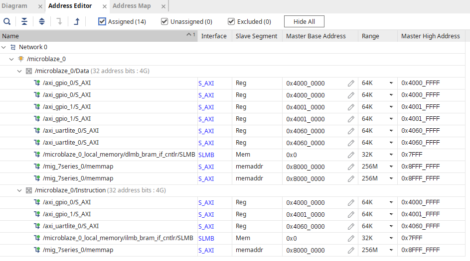

# Lab 2: GPIO Peripherals

{: .note }
> Redownload the [starter project](https://github.com/tkamucheka/eecs-4114-labs) before attempting this lab. The new starter project incorporates the following changes:
>
> 1. The AXI SmartConnects are replaced with AXI InterConnects. The AXI SmartConnects' internal circuitry does not adapt to accommodate addition of new peripherals in this and potentially future labs. This is either by design or a bug in the IP...  
> 2. An additional AXI Instruction port on the MicroBlaze. We'll need this later in the semester when we move our applications from local memory to DDR memory.
>
> __Things to do before you start this lab:__ 
>
> 1. Add the __AXI Uartlite IP__ to your design. Following instructions in [Lab 1: Vivado - Generating a bitstream (4)](../lab1/index.md#directions){: target="_blank"}.
> 2. Assign an address to the __UartLite IP__ in the "Address Editor" window.
> 3. Create an HDL wrapper for your block design.

## Introduction

In lab 1, we started with a basic MicroBlaze SoC, and we added a UART controller which gave us the ability to see the output of our applications. We want to do more with our SoC and the peripherals built into the Arty development board. Therefore, in lab 2, we will add two GPIO controllers to gain access to buttons, switches, and LEDs on our development board. After adding the GPIO controllers, we will synthesize our design and generate a new bitstream. Some boilerplate code is supplied that demonstrates how to connect push button inputs to the green LEDs. When a button is pressed, the corresponding LEDs on the opposite side of the board will light up. You will tinker with the supplied code, and observe how the pointers created are used to perform memory-mapped IO. From there, you will build on the supplied code to add support for the 4 switches on the [Arty board](./assets/datasheets/arty_rm.pdf) and make them control the corresponding RGB LEDs. In order to complete this laboratory successfully, you will need to understand the workings of the GPIO peripheral by reading the [GPIO (General Purpose Input/Output)](./assets/datasheets/axi-gpio.pdf).

## Project Assignment

- Create a new application project within SDK to upload to the [Arty](./assets/datasheets/arty_rm.pdf) development board:
  - Copy and paste the demo C code into your application
  - Load the demo code onto the Arty to observe the pointers in action
- Add to the existing code to create the following functionality:
  - When SW0 (far right) switch is in the up position, LD0 (far right RGB LED) will glow white.
  - When SW1 switch is in the up position, LD1 will glow white.
  - When SW2 switch is in the up position, LD2 will glow white.
  - When SW3 (far left) switch is in the up position, LD3 (far left) will glow white.
  - When the respective switch is down position, the respective LED will turn off.
  - Just like the buttons in the demo code, when the status of the switches changes, print to the console the current state of the switch register.
- Please allocate enough time outside of class to read and understand the project and the workings of the [GPIO](./assets/datasheets/axi-gpio.pdf).

## Directions

__Vivado - Block Design:__

1. In Vivado, open the "Block Design" from the "Flow Navigator" window.
2. Double-click on the __"microblaze_0_periph"__ AXI SmartConnect and change "Number of Master Interfaces" to (3). Click "OK" to close the dialog window. You should see two additional ports appear, __"M01_AXI"__ and __"M02_AXI"__.

3. Use the "__+ Add IP__" feature to add the AXI GPIO IP to your design:
    1. Right-click on the __"S_AXI"__ port on the GPIO controller and select "Make Connection...".
    2. Choose __"M01_AXI"__ in the "Make Connection" window and click "OK" to make the connection.
    3. Select "Run Connection Automation". Then select __"s_axi_clk"__ and __"M01_ACLK"__ and set __"Clock Source:"__ to `/mig_7series_0/ui_clk (81 MHz)`.
    4. Double-click on the AXI GPIO IP to open the "Re-Customize IP" window.
    5. Set the __GPIO__ interface to `led_4bits` and __GPIO2__ to `push_buttons 4bits`. Click "OK" to exit the window.
    6. Finally, select "Run Connection Automation" again, and select both __GPIO__ and __GPIO2__ interfaces. Click "OK" to automate the connections.
    
    7. Use the "Regenerate Layout" button to reorganize things in your block design.
    .
4. Add another AXI GPIO controller to your design:
    1. This time, connect the __"S_AXI"__ port to __"M02_AXI"__ port on __"microblaze_0_periph"__.
    2. For __"s_axi_clk"__ and __"M02_ACLK"__, use the same `/mig_7series_0/ui_clk (81 MHz)` clock you used earlier.
    3. Then connect __GPIO__ and __GPIO2__ interfaces to `rgb led` and `dip switch 4bits`, respectively.
    
5. Use the "Address Editor" window to assign addresses to the GPIO IPs you just added.
  
6. Save your block design and generate a new bitstream.
7. Export your hardware, making sure you include the bitstream, and Launch the SDK.

__Final Block Design (PDF Version):__ [Block Design](./assets/datasheets/block_design.pdf){: target="_blank"}

__SDK - Creating Software Project:__

```c
// GPIO Tutorial Using Pointers

/*
 * Because printf utilizes a UNIX-like streaming interface that has a buffer,
 * xil_printf is preferred as it has a smaller overhead (1KB), no buffer (it
 * prints immediately), but doesn't support printing floats or long long types.
 */
#include "xil_printf.h"

/*
 * Define statements: These statements are known as "preprocessor directives"
 * as they are essentially macros that are replaced with their values before
 * compilation. These are NOT global variables, just helpful values to refer to
 * constant values. It's a common/best practice to make these macros in CAPS.
 *
 * Again, DO NOT use them in place of variable declarations.
 *
 * It's common in embedded systems to have a "board.h" or "gpio.h" header file
 * referenced that just has all of the useful registers #defined for you.
 */

#define AXI_GPIO_0_BASE_ADDR 0x40000000

#define GREEN_LEDS_BASE_ADDR (AXI_GPIO_0_BASE_ADDR)
#define PUSH_BTNS_BASE_ADDR  (AXI_GPIO_0_BASE_ADDR + 8)

#define GREEN_LEDS_REG (unsigned *)(GREEN_LEDS_BASE_ADDR)
#define PUSH_BTNS_REG (unsigned *)(PUSH_BTNS_BASE_ADDR)

int main(void)
{
  // Data and tristate register ptrs for the 4 green LEDs on the Arty board
  unsigned *greenLEDsData = GREEN_LEDS_REG;
  unsigned *greenLEDsTri  = GREEN_LEDS_REG + 1;

  // Data and tristate register ptrs for the 4 push buttons on the Arty board
  unsigned *buttonsData = PUSH_BTNS_REG;
  unsigned *buttonsTri  = PUSH_BTNS_REG + 1;

  // Let's display our addresses now to see what the macros did:
  // You'll note the tri-state ptrs have an offset of 4 from the "+ 1" above.
  // This is because the size of an integer takes up 4 bytes, so every + 1 is
  // really addr + sizeof(int). You can use any base to increment the numbers
  print("\r\nBegin...\r\n\r\n\tRegister Offsets:\r\n");
  xil_printf("\tgreenLEDsData register \t= 0x%08x\r\n", (int)greenLEDsData);
  xil_printf("\tgreenLEDsTri register \t= 0x%08x\r\n", (int)greenLEDsTri);
  xil_printf("\tbuttonsData register \t= 0x%08x\r\n", (int)buttonsData);
  xil_printf("\tbuttonsTri register \t= 0x%08x\r\n", (int)buttonsTri);

  // Set the tri-state direction of the AXI_GPIO_0 pins.
  // Buttons = inputs, LEDs = outputs
  // (input = high, output = low)
  *greenLEDsTri = 0x0;
  *buttonsTri = 0xF;

  // Used to determine if the program should print to the console
  int oldButtonsData = 0;

  // Infinite loop
  while(1)
  {
    // Set the LED register to be the same as the buttons' current reading
    *greenLEDsData = *buttonsData;

    // To avoid spamming the COM terminal with each loop, let's only print if the
    // status of the buttons register has changed:
    if (*buttonsData != oldButtonsData)
    {
        oldButtonsData = *buttonsData;
        xil_printf("buttonsData register: 0x%08x\r\n", *buttonsData);
    }
  }

  return 0;
}
```

1. Create a new application project:
    1. Give your application a name (e.g. lab2).
    2. For __"Board Support Package:"__, select "Create New".
    3. On the next page, select "Empty Application", and select "Finish".
    4. Right-click on `lab2/src`, and select `New > Source File`.
    5. Enter "main.c" in __"Source File:"__ and select "Finish".
    6. Copy the example code into your "main.c" file.
    7. Program the FPGA and run the application to see the green LEDs respond to button presses.
2. Add your own code to achieve similar behavior with the dip switches and RGB LEDs:
    - When SW0 (far right) switch is in the up position, LD0 (far right RGB LED) will glow white.
    - When SW1 switch is in the up position, LD1 will glow white.
    - When SW2 switch is in the up position, LD2 will glow white.
    - When SW3 (far left) switch is in the up position, LD3 (far left) will glow white.
    - When the respective switch is in the down position, the respective LED will turn off.
    - Just like the buttons in the demo code, when the status of the switches changes, print to the console the current state of the switch register.

__Hints:__
{: .label .label-green}

- For RGB LEDs and dip switches, find the memory address of __"axi_gpio_1"__ in the `base_soc_wrapper_hw_platform_0/system.hdf` file. Alternatively, you can find the address in the "Address Editor" window in Vivado.
- Unlike the green LED data register, which is only 4 bits wide, the RGB LED data register is 12 bits wide. Starting from the MSB (Most Significant Bit), each LED occupies 3 bits - 1 for each of the RGB (Red, Green, and Blue) channels. The first 3 bits control the right-most LED (LD0). To turn LD0 white, write 1's to all three color channels (i.e. `0b111` or `0x7`).
- You can use bit-wise boolean operations to toggle bits in a register. Refer to class slides on bit twiddling in C.

## Submission

1. Prepare a lab report, and give an account of what you did to complete the lab.
2. In your lab report, include a screenshot of the 2 AXI GPIO controllers you added to your design.
3. Submit your code file.

## Prelab Assignment

1. Read the [AXI GPIO Datasheet](./assets/datasheets/axi-gpio.pdf). Familiarize yourself with all the accessible registers inside the IP, and their offsets from the base address.
