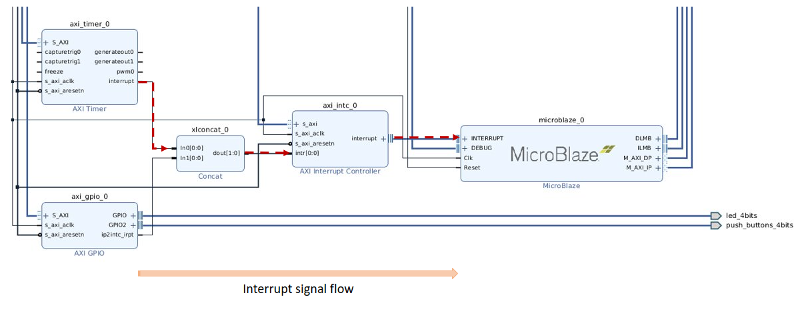

# Lab 4: Timers

In this lab, we will replace the dummy loops inserted in the previous lab to waste a certain amount of time for transitioning the traffic lights with more precise delays provided by the [Xilinx AXI Timer core](https://docs.xilinx.com/v/u/en-US/pg079-axi-timer). The timer core contains two 32-bit timers that can be used independently or combined to form either (1) an extended 64-bit timer, or (2) a Pulse Modulation Wave generator. When used independently each timer can be set up in either (1) Capture, or (2) Generate Mode. There are many solutions you could implement for this lab using a combination of the two timers. However, the simplest solution is to use one timer in the Generate Mode.

{: .note}
Before you enter the lab you should read and familiarize yourself with the [Timer Core Datasheet](https://docs.xilinx.com/v/u/en-US/pg079-axi-timer).

Specifically, you should study the data sheet to determine:

1. How to set the control register to configure the timer to be in the generate mode, count down, automatically reload, and disable the generation of an external interrupt.
2. How to set the control register to transfer the value from the load register into the timer and then start the timer.
3. How to poll the status register to identify when the counter transitions to 0 (i.e. 3..2..1..0... reload new count from load register). You will have to poll (read) a specific bit in the control and status register (TCSRx). Once the transition is identified, clear the same bit by writing back a 1.

__NB:__ A button press in the second flashing state should not reset the stage. 

## Project Assignment

What follows next is a description of how to use a single timer in the Generate Mode to provide all timing for the Fayetteville Bike crossing. Here is a strategy:

1. Create a delay word to write into the load register to have the timer go off every .5 seconds.
2. When you enter the green light state, turn off the timer.
3. When you enter the first flashing red state, turn on the timer. You can then use the timer going off every .5 seconds as your signal to alternate the red LED (flashing red light changes every .5 seconds). You will have to check for an additional button push which resets the sequence for another 6 seconds from the button push.
4. In the solid red state, the red light signal will remain on for four seconds. You can time this state by counting the number of .5-second timer events.
5. When you enter the second flashing red sequence, the timer will be on, and you can use the timer to once again alternate the flashing of the light every .5 seconds.

## Project Directions

To start off, we need to add the AXI Timer module to our SoC. This means we need to go back into Vivado and make some modifications to our block design. If you have kept your project organized such that you can modify your original design, then go ahead. If not, then you may need to redownload the starter project and add the AXI Uartlite, 2 AXI GPIO, and AXI Timer to your design as we did in previous labs.

### Vivado - Modifying the Block Design

{: .warning}
> Move quickly through this section to give yourself ample time to complete the coding exercise.

Now that we have our Vivado project open, we need to go into the block design. Once in the block design, perform the following steps:

1. Start by opening the block design.
2. Add the AXI Timer to your design.
    1. Use the **"+ Add IP"** feature to add the **AXI Timer** to your block design.
    2. Use the **"Run Connection Automation"** feature to connect the AXI Timer to the AXI SmartConnect.
3. Now, to future-proof the design with interrupt capability, add the "AXI Interrupt Controller" to the design in the same fashion as the timer.
4. Enable interrupts on AXI GPIO IP with where you connected **"push_buttons_4bits"**:
    1. Double-click on **"axi_gpio_0** IP block.
    2. Select **"Enable Interrupt"**, and then **"OK"** to enable GPIO interrupts.  
5. Finally, we want to create a signal path for interrupt signals originating from IP blocks (like the AXI Timer) to reach the AXI Interrupt IP. We will need to manually connect certain I/O signals to accomplish this. 
    
    1. Use the **"+ Add IP"** feature and add a **"Concat"** IP.
    2. Connect the **"interrupt"** output port on the AXI Timer IP to the **"In0[0:0]"** input port on the Concat IP.
    3. Connect the **"ip2intc_irpt"** output port on the **"AXI GPIO"** (with push buttons) to the **"In1[0:0]"** input port on the Concat IP.
    4. Connect **"dout[1:0]"** output port on the Concat IP to **"intr[0:0]"** input port on the AXI Interrupt Controller.
    5. Connect the **"interrupt"** output bus port on the right side of the "AXI Interrupt Controller" to the **"INTERRUPT"** bus input port on the left side of the MicroBlaze IP block.
6. Regenerate the layout and take a screenshot of your design. If you need help later on in the lab, I will need to see this layout to ensure you connected everything correctly.
7. Now, just like previous labs, assign addresses to the new IP blocks, validate the design, and generate a bitstream.
8. Export the bitstream and launch Vitis from the respective File menu options.

{: .info}
> The Concat IP combines individual signals into a single bus.

### Vitis - Creating Software Project

Now, within Vitis, create a new blank Application project for Lab 4. You are eventually going to transfer your FSM design of our bike-crossing light over and use the timer instead of the delay function previously created. Before you do this though, take some time to play around with the Timer module in C code either using the Xilinx API by including "xtmrctr.h" as a header file, or by using pointers like how you interface with GPIOs currently. The implementation choice is up to you. If you would like to use the "xtmrctr.h" APIs, you can open up the system.mss file included with your project, and it will show the peripherals you currently have installed and C examples for how to interface with them with Xilinx APIs.

{: .note}
_Since this method of controlling the timer is vastly different from using the Timer API, I will only be able to aid in debugging with pointer implementations. So if you do not make headway with the API or don't know where to start, choose the pointer method._

```c
// Example: LEDs Binary Counter
void main(void)
{
  // Setup LED data and direction registers here...

  // Setup timer registers here...

  // Initialize counter variable
  int counter = 0;
  
  // Loop forever
  while(1)
  {
    counter++;
    *ledDataReg = counter;
    
    // Since we only have 4 LEDs,
    // Limit the counter to count up to 15 only
    counter = counter & 0xF;
  }
}
```

The base implementation of the pointer method is detailed below:

1. Locate the addresses for the necessary timer registers detailed in the datasheet in the same way you located the LED and switch registers from the previous labs.
2. Create a simple C program that implements an LED counter. I recommend the 4 green LEDs just for
simplicity.
    - The goal of this mini project is to get the timer to function in 1-second intervals to ensure you have everything working before trying to add timers to your existing FSM code and getting confused.
    - Before adding any timer code, ensure you can blink an LED or implement a binary counter timer, like the example above.
3. You will notice, if trying to run the above code, that all LEDs will just look like they are lit and not counting at all. This is because the `while` loop is going superfast. We can temporarily slow this down with an empty `for` loop somewhere in the `while` loop that looks like this: `for (int i = 0; i < 5000; i++);`. You should be able to see the individual LEDs blink now.
4. Now let's set up the timer before that `while` loop. You should have read the datasheet on the particular registers, so it should be a simple task to set the necessary bits in the following registers:
    1. For this sample code, we want the LEDs to count up every second. So we want the timer to count down from a certain value and when it hits 0, it will raise a flag. So, given the timer runs off the 81.247 MHz clock, counting down from 81.247 million will take approximately one second to do. Set TLR0 to 81.247 million.
    2. For TCSR0, we want to set a combination of bits in a certain order. First, set the mode to generate, set the timer to count down, and we want to auto-reload the timer, and we want to load the TLR0 into the timer register. All of this can be set at once using a binary or hex number value, like this (values are not correct): `*TCSR0 = 0b1001001010`.
    3. Now to enable the timer, the data sheet says that if we load a value into the load register (by setting bit 5 in TCSR0), we need to clear that bit before enabling the timer, otherwise the timer will not start. So again, set the TCSR0 register, but clear bit 5 while also setting the "enable timer" bit. The timer will now count down from 81.24 million and will raise a flag on TCSR0 (bit 8) when it hits 0.
5. Finally, to use the timer in action, we need to detect when that flag is set in our `while` loop and take appropriate action to clear the flag, so we can detect when the next countdown hits 0.
    1. Remove the `for(...)` loop that was created above to slow down the `while` loop. This `for` loop and our previously created `delay_ms()` function stall the processor, so it has to take a considerable amount of time processing pointless instructions when it could be executing other code in the `while` loop. Instead, we want to make the `while` loop as fast as possible and not stall it.
    2. We want to poll the timer to see when it expires and take action to reset it. Therefore, in place of the `for` loop, create an `if` statement that can detect the expired/done (`T0INT`) flag bit of the timer. Something like this would work: `if((*TCSR0 & 0b00100000000) == 0b00100000000)`. Now, if and only if the timer counted down to zero, we want to increment our count, so move the `count++` into this if statement.
    3. If you were to run this code at this point, it would not work. This is because you need to clear this flag bit once you discover it is set, else you would just read the flag with every following loop. To clear the bit, the data sheet says to set the bit to 1 (yes, it already is a 1 when you read it, but it is designed to reset when you write a 1 to it). Add the necessary operation to set the bit inside the if statement.
6. Run the code and observe how it counts up to 15 with each step taking one second.
7. Now that you know how to interface with the timer, implement the above behavior using your FSM from last week. Replace the stalling `delay_ms()` function with appropriate function calls that turn on, off, and read the timer complete flag.

{: .note}
> Ask for clarification if you have any questions...

## Submission

1. Prepare a lab report, and give an account of what you did to complete the lab.
2. Lab 3 and Lab 4 code files
3. Upload your files separately on Blackboard. **No zip files!**

## Prelab Assignment

Your answers should be typed and printed with your name, date, and lab number. In addition to answering the following questions, please read the lab assignment on this page and reread the Xilinx AXI Timer Datasheet. You may want to write pseudo code if you think you may have trouble finishing the project during your lab time or if you're feeling like a good student.

1. What is the advantage of a timer over the previously used delay_ms function?
2. There are several registers required to interface with the timer module in the SoC, what are those registers and what is their function?
3. When enabling the timer, there is one bit you need to set and one bit you need to clear. What are those two bits?
4. What two methods exist in C for setting the timer parameters?

## References

1. [Xilinx AXI Timer core](https://docs.xilinx.com/v/u/en-US/pg079-axi-timer)
