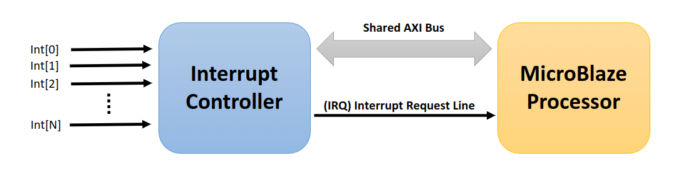

# Lab 5: Interrupt Driven MicroBlaze System

The goal of these labs is to become familiar with the idea of interrupt-based processing techniques using the MicroBlaze processor. A base system will be built that utilizes an interrupt controller to allow for multiple interrupt sources along with a set of interrupt sources. The interrupt sources will include a timer as well as a software interrupt. After understanding what an interrupt does and how to properly implement them, we will then return to the bike trail crossing project and modify the design to use interrupts. You covered interrupts in class exactly as they work with the MicroBlaze.

{: .note}
> You can refer to Dr. Andrews' slides from lecture if you have conceptual misunderstandings.

## Lab Directions

{: .new}
> Code examples for this lab have been updated - 09/26/2024

For this lab, you will explore the use of software interrupts and timer interrupts in example programs, and then you will modify the design of the Fayetteville bike crossing signal to rely on interrupts rather than polling to see if the timer has completed.

To keep the design consistent between all students for grading purposes, the final design should contain/do the following:

1. Display a green (RGB) output on the display when no bikers or walkers are trying to cross the street.
2. Display a flashing red output on the display immediately after any of the tactile push buttons are pressed.
    - This stage should last a total of 6 seconds
    - The amount of time the LED should be on or off in the flashing stage should be 0.5 seconds. (e.g. 0.5s on, 0.5s off, 0.5s on, ...)
    - If the button is pressed during this stage, the 6-second timer should reset back to zero and the LEDs should blink for another 6 seconds. This is the only stage where this happens.
3. After the LEDs have flashed red for 6 seconds, the traffic signal should display the red LEDs for exactly 4 seconds.
4. After the solid red stage, the red LEDs should then flash red again for 6 seconds. A button press here should not affect nor reset any stage countdown timer.

## Background

The MicroBlaze processor has only a single interrupt port, called the Interrupt port. This port is a 1-bit signal that can be configured to be either edge- or level-triggered. A multiplexer must be used in order to create a MicroBlaze based system that has multiple interrupt sources. A multiplexer built specifically to handle interrupt sources is often referred to as an interrupt controller, or often, a programmable interrupt controller (PIC). The following diagram demonstrates how an interrupt controller is used to multiplex many interrupt sources onto a single interrupt request line.

In this type of situation the processor must be able to determine which interrupts have fired and need servicing.
Most interrupt controllers contains registers that allow a processor to query the following:

1. Which interrupts are enabled?
    - Interrupt Enable Register (IER).
2. Which interrupts have fired and need servicing?
    - Interrupt Service Register (ISR).
3. Which interrupts need to be cleared?
    - Interrupt Acknowledge Register (IAR).

When the processor receives an interrupt, it must first look at the Interrupt Service Register (ISR) to figure out which interrupts need to be serviced. Each bit in the ISR represents an individual interrupt source. If a bit X in the ISR is '1' then interrupt source X needs to be serviced. If bit X in the ISR is '0' then the interrupt has not fired and does not need to be serviced.

After servicing each active interrupt, the processor must then clear the interrupt as well as its source. The ordering of this operation is extremely important due to the fact that clearing an interrupt before clearing its source will result in apparent multiple interrupt events for a single source event. Therefore, it is pertinent to always clear an interrupt at its source, and then proceed to clear the interrupt at the PIC and at the processor.

{: .note}
> If interrupts are cleared incorrectly then “bad” situations can occur.
>
> __For example:__
>
> 1. Interrupt 0 occurs.
>     - Bit 0 in the ISR is set to 1.
> 2. CPU receives an interrupt and then CPU jumps into its interrupt handler routine.
> 3. CPU checks Bit 0 in the ISR.
>     - CPU then services the interrupt, but forgets to clear Bit 0.!!!
> 4. The CPU now returns from its interrupt handler routine to continue “normal” processing.
> 5. __BUT WAIT!!!__ Bit 0 was never cleared, so the CPU's interrupt line is still asserted.!!!
>     - The CPU jumps right back into the interrupt handler routine, even though no new interrupts have occurred.!!!

In order to correct the situation described above, the interrupt handler should clear the interrupt at its source, and then at the PIC in step (3). Clearing an interrupt at the PIC can be done by writing a '1' to the bit of interest in the PIC's Interrupt Acknowledge Register (IAR).

## Project Assignment

{: .highlight-title}
> Before Executing the Lab:
>
> I recommend looking through the [AXI Timer](https://www.xilinx.com/support/documentation/ip_documentation/axi_timer/v2_0/pg079-axi-timer.pdf) and [AXI Interrupt Controller](https://www.xilinx.com/support/documentation/ip_documentation/axi_intc/v4_1/pg099-axiintc.pdf) data sheets to better understand the modules we will be working with in this lab.

**Hardware:**

In lab 4, we made modifications to the block design in Vivado to enable future interrupt capability. Therefore, we do not need to modify our SoC this week. Our projects already everything we need to support interrupts.

**Software:**

Now, you must write software to enable the interrupt features of the interrupt-based system. This involves writing initialization code that will enable interrupt-related functions on all the interrupt sources, the interrupt controller, and the MicroBlaze processor. Additionally, an interrupt handler routine will be written to handle interrupts when they occur. Conceptually, an interrupt handler routine can be thought of as a function that can be called automatically any time and interrupt occurs (if interrupts are enabled). This implies that an interrupt handler routine must not have any effect on the state of the CPU, otherwise, program behavior could be seriously altered by the assertion of an interrupt.

__An Example:__ Consider a program controlling a stoplight puts a counter value in r20 to represent how long to keep the yellow light lit, and let us also say that a “rogue” interrupt handler routine always sets r20 to `0x0000_0000`. The program would not be able to detect when this happens due to the fact that an ISR can be invoked at any time when an interrupt occurs. This would essentially cause the stoplight to go from green to red instantly, which could result in adverse real-world effects.

On the other hand, an interrupt handler routine is allowed to change values in memory (i.e. variables, device registers, etc.) as this does not have any side effects on the actual state of the CPU. Thus, an interrupt handler routine must save all pertinent CPU state upon an interrupt, and must restore the CPU state after servicing needed interrupts. In the case of the MicroBlaze processor, this is handled by the “main” interrupt handler routine; which is a function that “wraps” up the user’s interrupt handler routine in such a way that the user does not have to worry about saving CPU state. This requires a programmer to “register” their interrupt handler routine so that the “main” interrupt handler knows which user-level handler to call upon invocation of an interrupt. Essentially, registration just involves putting the address of the user-level function in a place known by the “main” interrupt handler. This place is known as the interrupt vector table.

{: .info}
> Interrupts on the MicroBlaze can be enabled/disabled by interacting with the MSR register. The MSR register is a special purpose register; the `MTS` and `MFS` instructions are needed to read/write the MSR register. You can look at the [MicroBlaze Reference Guide](https://www.xilinx.com/htmldocs/xilinx11/mb_ref_guide.pdf) for more information.

The basic order of operations for your software should be the following:

**Main program:**

1. Setup interrupts...
2. Register a handler...
3. Enable interrupts on all sources...
4. Set up the timer to generate a periodic interrupt...
    - This is done by setting bits in the timer Control and Status Register.
    - In our case there a few hints I will give you, but the rest have to be understood and set by you:
        - The timer mode should be set to generate mode.
        - Enable external generate signal and enable external capture bits should be set to 0.
        - For the timer to Load a value it shouldn't be running.
        - For the timer to run, the load bit should be a zero.
        - Pulse width modulation should be set to a zero.
5. Enable interrupts on the MicroBlaze...
6. Enter an infinite loop to print out a global variable, called X.

**Interrupt handler:**

1. Service each interrupt that has fired.
2. Do this by incrementing the global variable X.
3. Clear them at the source, then the PIC.
4. Clear and service all interrupts that have fired.
5. Return

It's worth noting that all of these steps are required to get interrupts working from the ground up, but some functions provided by Xilinx that we will be using actually perform these operations behind the scenes. As you look through the examples in the SDK project, feel free to explore the source code of the provided functions by right-clicking on functions, variables, or definitions and selecting "Open Declaration" to see where these calls are actually made.

## Project Instructions

1. Open Vivado and launch the SDK.
2. From here, load the bitstream on to the Arty board.
3. Before moving on to timer interrupts, let's look how we can trigger an interrupt using software with a provided example:
    1. Create a new application project.
    2. Create a new source file in the `src` directory of your project.
    3. Insert [this example code: xintc_example.c](./xintc_example.md){: target="_blank"} into your source file.
    4. Open up a serial terminal monitor (SDK Terminal) to the correct COM port like in earlier labs.
    5. In the Project explorer, right-click the current project folder (say "lab5") and select `Debug As > Launch on Hardware (System Debugger)`. The code will stop as soon as it enters the main function.
    6. Step through the code (by pressing F5) to see what each step is doing and how it operates. At some point in execution, you will see a function call to `XIntc_SimulateIntr` which will set the ISR register and will seemingly reroute the execution to the `DeviceDriverHandler` function at the bottom. You will not actually see the call to `DeviceDriverHandler`, but the text "Interrupt occurred: ..." will be printed in the "SDK Terminal" window.
    7. This function will write to the console that an interrupt has occurred and then will resume execution where it left off.
4. Now that we have seen an example of how the ISR can be set with the "simulate interrupt" function, let's now use the timer to trigger the interrupt. Open up [this example code: xtmrctr_intr_example.c](./xtmrctr_intr_example.md){: target="_blank"}. This code demonstrates a useful example where the MicroBlaze is just executing a `while` loop where it outputs a counter value to the LEDs, yet is constantly interrupted to update the counter that the LED is outputting.
5. Observe the extra steps to set up the timer interrupt and the options that were previously set using direct register setting operations with pointers, now using API function calls.
6. Also observe how the functions for setting up both the interrupt controller and the timer were extracted into the main function in a linear format so that the instructions could be seen without the need to jump into the function calls. In your implementation of the timer interrupts, take these operations and group them into meaningful function calls, so your code isn't as linear as this demonstration.
7. Run this code. Note that it is a simple binary counter that increments every half second. Sound familiar?
8. Take some time to really understand this code, then create a new project and add the FSM design, but modify the design to use the interrupts instead of relying on polling. Remember that there are stricter grading guidelines for this lab, so be mindful of the timing for each state.

## Submission

1. Prepare a lab report, and give an account of what you did to complete the lab.
2. Lab 5 code files
3. Upload your files separately on Blackboard. __No zip files!__

## Prelab Assignment

- Instead of pre-lab questions this week, I encourage you to please read through this entire lab assignment once and go through the _(commented)_ [Simulated Interrupt Example](./xintc_example.md) and [Timer Interrupt Example](xtmrctr_intr_example.md) programs linked in the notes.

## References

1. [AXI Timer Documentation](https://www.xilinx.com/support/documentation/ip_documentation/axi_timer/v2_0/pg079-axi-timer.pdf)
2. [AXI Interrupt Controller Documentation](https://www.xilinx.com/support/documentation/ip_documentation/axi_intc/v4_1/pg099-axi-intc.pdf)
