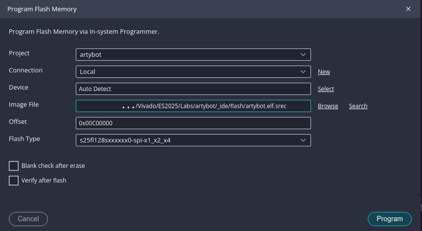
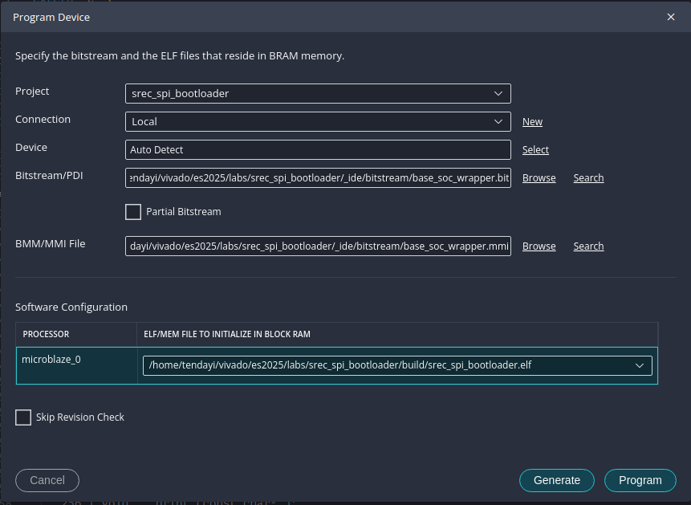
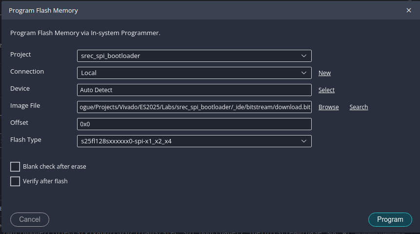

# Lab 8: Autonomous Vehicle

## Week 1

### Introduction

This first week is devoted to assembling and testing your autonomous robot. First, you and your partner will modify your SoC to include the peripherals necessary for communication with the car sensors. Then you will follow the video instructions to assemble the shadow chassis, which is the base platform for your Arty Bot. Your TA will be available to help you through the assembly process. Zip ties and "engineering grade" rubber bands will be available in the lab if you need them.

### Lab Instructions

{: .note}
> Start by downloading this [IP Repository](./assets/ip_repo.zip). It contains 
> some of the IPs we'll need for our robot project. Extract the "ip_repo" directory 
> and place it in your SoC project directory.

1. Now let us make some changes to our SoC (System on Chip). Start by opening your project in Vivado. In the **Flow Navigator** on the left side, navigate to **“Open Block Design.”**
2. To add our downloaded IP to Vivado, navigate to **“Project Settings”** to open the **Project Settings** dialog. In the left panel select **“IP,”** then select the **“Repository Manager”** tab. Now add the IP repository folder you copied earlier. Select **“Apply”** and close the dialog.
3. Back in the block design of your SoC. We want to add IP to the SoC for communicating with the external Pmod peripherals. We will add AXI GPIO, Pmod_DHB1, and Pmod_Dual_MAXSONAR IP for communication with the two line detecting light sensors, Pmod MAXSONAR sensor, and Pmod DHB1 motor driver.  

    {: .warning}
    > **Do not use connection automation for the PMod connections...**  

    1. **AXI GPIO >> jA >> Pmod LS1:**
        - Using the **+ Add IP** button and dialog. Add a new **AXI GPIO** and
        **Pmod Bridge** IP to your design.
        - Connect the **S_AXI** bus port of the AXI GPIO to a port on the interconnect.
        - Connect the two GPIO ports on the AXI GPIO with the **GPIO_Top_Row** and
        **GPIO_Bottom_Row** on the Pmod Bridge.
        - Finally, in the “Board” window on the left, right-click the **jA** port
        under Pmod and select “connect component.” In the dialog that appears,
        find the Pmod bridge you just added and select the **Pmod_out** port as your
        connection. One more thing, enable interrupts for the AXI GPIO.
    2. **Pmod_Dual_MAXSONAR >> jB >> Pmod MAXSONAR:**
        - Add the **Pmod_Dual_MAXSONAR** IP and connect it to a Pmod Bridge.
        - You can connect the **Pmod_out** port of the Pmod Bridge to the **jB** Pmod port.
    3. **Pmod_DHB1 >> jD >> Pmod DHB1:**
        - Add the **Pmod_DHB1_v1_0** IP and connect it to the **jD** Pmod port through
        a Pmod Bridge.

4. Go to "Address Editor" window of the block design and make sure all the newly added IPs have unique address spaces. You can use the "Auto Assign Address" feature if any IPs have not been assigned addresses.
5. Validate your design and generate a bitstream.

### Project Assignment

1. Watch the assembly [instruction video](https://www.youtube.com/watch?v=aJRYTqZu5OE) or follow the [instructions given here](https://learn.sparkfun.com/tutorials/assembly-guide-for-redbot-with-shadow-chassis) to assemble your robot's chassis.
2. Mount the two IR (infrared) Proximity sensors somewhere on your car.
    1. Select two of the four pin headers (S1, S2, S3, or S4) on the Pmod LS1 module to connect the two IR sensors. For example, you can connect one sensor to S1 and the other to S2. Just remember which pin headers you used as you'll need this information when programming the car.
    2. Connect the Pmod LS1 module to the Arty board via the Pmod port you connected the AXI GPIO in the board design.
    3. When mounting the sensors on the car:
        1. Try to mount them as close as possible to the floor.
        2. Angle them so that they are perpendicular to the ground.
3. Mount one or both Pmod MAXSONAR sensors somewhere on your car.
    1. Use the provided Pmod extension cables to connect the sensors to the Pmod port where you connected the "Pmod MAXSONAR IP" in the board design.
    2. Connect one sensor to the bottom row of the Pmod port and the other to the top row of the same Pmod port. If you only have one sensor, connect it to either the top or bottom row of the Pmod port. Just remember which row you used as you'll need this information when programming the car.
4. Connect the Pmod DHB1 to the Arty board via the Pmod port you selected in the board design. Now make the following connections on the Pmod DHB1 module:
    1. Connect the left and right motors to the screw terminals J5 and J6.
    2. Connect the Hall effect sensors to J7 and J8. The red wire is VCC, black is GND, and white is motor feedback. The motor feedback signal is used to count wheel revolutions using the Hall effect sensors.
    3. Connect the AA battery pack to the screw terminal at J4.

### Prelab Assignment

Take a look at the original project blog post and datasheets listed below:

1. [Tang, A. ArtyBot - A two-wheel robotics platform built on the Arty development board. Hackster.io](https://www.hackster.io/atang08/artybot-551478)
2. [Pmod Interface Specification](https://digilent.com/reference/_media/reference/pmod/pmod-interface-specification-1_3_1.pdf)
3. [Pmod LS1 Reference Manual](https://digilent.com/reference/pmod/pmodls1/reference-manual)
4. [Pmod MAXSONAR Reference Manual](https://digilent.com/reference/pmod/pmodmaxsonar/reference-manual)
5. [Pmod DHB1 Reference Manual](https://digilent.com/reference/pmod/pmoddhb1/reference-manual)

---

## Week 2

### Introduction

Now that you have assembled your car, the next step in our journey is learning how to flash programs onto FPGA boards. Doing so will cause the FPGA board to automatically load your program from flash memory as soon as you connect the board to a power source to the board. In order to accomplish this, we will have to make one more modification to the SoC.

### Lab Instructions

**Vivado:**

We're going to add the SPI Flash Memory to our design. The instructions below will walk you through the process.

1. Open your SoC project in Vivado and navigate to the block design.
2. Double-click on the "clocking wizard" IP block to open the "Re-customize IP" window.
    1. Under "Output Clocks", add a new 50 MHz clock.
    2. Name the new clock output port **"clk_50MHz"**.
    3. Click "OK" to save the changes and close the window.
3. Let's add the **"AXI Quad SPI"** flash memory controller:
    1. Navigate to the **"Board"** window.
    2. Right-click on the **"Quad SPI Flash"** and select **"Auto Connect"**. This should add a new IP block to your design.
    3. Use the **"Connection Automation"** feature to make the following connections:
        - **AXI LITE:** `/microblaze_0 (Periph)`, `/mig_7series_0/ui_clk (81 MHz)`
        - **ext_spi_clk:** `/clk_wiz_0/clk_50MHz (50 MHz)`
4. Double-click on the **"AXI Quad Flash"** controller to open the **"Re-customize IP"** window:
    1. Under **"IP Configuration"**, change the **"Slave Device"** option to `Spansion`.
    2. Select **"OK"** to save the changes and close the window.
5. Validate your design, and generate a bitstream.
6. Export your project XSA. Remember, to select to **"include bitstream"** option.

{: .info}
> Spansion is the manufacturer of the SPI flash memory chip on the FPGA dev board.
>
> -- [follow this link for more details](https://digilent.com/reference/programmable-logic/arty-a7/reference-manual#quad-spi_flash).

**Vitis:**

1. Download [this GitHub repo](https://github.com/tkamucheka/embedded-systems-lab/tree/main), and look at the example applications in the __"embedded_systems_lab.sdk"__ directory. The examples demonstrate how to use the sensors and control the motors on your car.
<!-- 2. Download the [Board Flashing Guide](./assets/slides/Board-Flashing-Instructions.pdf). The guide will show you how to flash any application onto your FPGA board. You can use any application from the "Fayetteville Bike Crossing" series to test the process. -->
2. Design an application capable of driving your car and following the line around the track.

{: .hint-title}
> Hints:
>
> 1. The light sensors will pick up reflections from shiny objects. Use them to
>    detect the reflective tape on track.
> 2. The sonar sensors API function will return a distance value in inches. When
>    you test them, point them towards a large open area. Spaces with many objects
>    nearby will give you false readings.
> 3. Test the functionality of your sensor on your desk first before moving to the
>    track. This will save you a lot of time during development.
> 4. If you get stuck, ask for help.
> 5. While I recommend using FreeRTOS, you are free to design your application
>    however you see fit. Remember, there are bonus points on the line. Take them
>    by any means necessary!
>
> __Good luck!__

### Project Assignment

<!-- {: .note} -->
<!-- > The PDF instructions have more details and illustration images. -->

Turn your car into a line following robot. The line will be a (silver) duct tape track, and your car should drive around the track following the line. There will be an obstacle at the end of the track, use this to stop your car. You'll have to do the following:
1. Use the **GPIO PMOD LS1** to detect when your car drives over the line and steer that car back onto the track
2. Use the **PMOD MAXSONAR** to detect obstacles and stop the car before the obstacle.
3. Program the Arty's non-volatile 16 MB Quad-SPI flash memory with your SoC and application so that your application runs when you power on the Arty board.

Programming the Quad SPI Flash Memory:

{: .important}
> 1. This section assumes the following:
>     - You already added the Quad SPI Flash memory controller to your SoC in Vivado.
>     - You exported your hardware design (XSA) from Vivado and imported it into Vitis.
>     - You have created a Vitis platform project using the imported hardware design.
>     - You have created your application project in Vitis; Any application, including older labs. 
> 2. The file names in this section may be different from what you have in your project. Just remember what you named your SoC in Vivado and project name in the SDK and the rest should look familiar. If you are unsure ask your TA for help.

{: .info}
> The following is a 2-step process. First, we will flash your application to the SPI flash memory. Then we will create and flash a bootloader that will load your application from the SPI flash memory when the Arty board is powered on.

**Quad SPI Flash Memory Map Information:**
The SPI Flash memory on the Arty board is 16 MB in size. We will divide this memory into two regions:
1. Bootloader Region - This region will store the bootloader program that loads your application from the flash memory when the board is powered on. This region will occupy the first 12 MB of the flash memory.
2. Application Region - This region will store your application program. This region will occupy the remaining 4 MB of the flash memory.

| Memory Region       | Base Address  | High Address  | Size      |
|---------------------|---------------|---------------|-----------|
| Bootloader Region   | 0x00000000    | 0x00BFFFFF    | 12 MB     |
| Application Region  | 0x00C00000    | 0x00FFFFFF    | 4 MB      |

**System Memory Map Information:**
The following table shows the memory map for the MicroBlaze processor:

| Memory Region       | Base Address  | High Address  | Size      |
|---------------------|---------------|---------------|-----------|
| Local Memory (BRAM) | 0x00000000    | 0x0001FFFF    | 128 KB    |
| DDR Memory          | 0x80000000    | 0x8FFFFFFF    | 256 MB    |

{: .note}
Local Memory size may vary based on your design.

When you compile your application, you can modify the linker script to select the memory region where your application will be stored. Until now, we paid no attention to this because we simply did not care where our application was stored. However, now that we are essentially creating a custom boot process, running two applications (bootloader and main application), we need to be more careful about where we store our application.

{: .important}
Our application will have to be stored in the DDR memory region, while the bootloader will be stored in the local memory region. This setup, allows us to load the bootloader program first, which will then load the main application from the SPI flash memory into the DDR memory region. Once the application is loaded into DDR memory, the bootloader will transfer control to the application, and the application will start executing.

**Flashing your application to SPI Flash Memory:**

1. Open the linker script in your application project. You can find it in the `src` directory of your project.
2. Find the "Section to Memory Region Mapping" portion of the linker script. Change all the memory regions from `microblaze_0_local`... to `mig_7series_0_memory`. Save and close the file.
3. From the menu bar, select __Xilinx > Program Flash__ to open the flash programming window.
4. In the flash programming window, do the following:
    - **Image File:** Click __Browse__ and navigate to your project folder, then into `Build`. Select [your_project_name].elf and click open.
    - **Offset:** Enter `0x00C00000`. This is the address offset where your program will be stored in the flash memory.
    - **Flash Type:** Select *S25FL128sxxxxxx0-spi-x1_x2_x4*.
    - __IMPORTANT__, make sure to select 'Convert ELF to bootloadable SREC format'.
    - **Image File:** Copy the SREC file path that is generated, and paste it into the Image File field. 

5. Click __Program__.

**Creating and Flashing the Bootloader to SPI Flash Memory:**

1. Create a new platform using your newly minted hardware design (XSA) that includes the SPI flash memory controller.
2. From the Vitis menu bar, select __File > New Example__.
3. Select **SREC SPI Bootloader** from the list of examples. Click **Create Application Component From Template**.
4. Create the SREC Bootloader application component in the newly created platform.
5. Open the linker script in the bootloader project. You can find it in the `src` directory of your project.
6. Find the "Section to Memory Region Mapping" portion of the linker script. Change all the memory regions from `mig_7series_0_memory`... to `microblaze_0_local`. Save and close the file.
7. We need to make a few changes to our bootloader before loading it onto the Arty board.
    - First, we need to set the 'address offset' so the bootloader can find our application. In the 'Bootloader' project, open the __blconfig.h__ file and change the __FLASH_IMAGE_BASEADDR__ to `0x00C00000`. Note, this same address you used when you flashed your application onto the flash memory earlier.
    - __Optional__, if you wish to improve your ArtyBot's startup time. Edit the file bootloader.c and comment out the line `#define VERBOSE`. This will turn off console logging. 
    __NB:__ *Console logs may be useful when you're initially setting things up*.
8. In the menu bar, select __Xilinx > Program FPGA__ to open the FPGA programming window.
9. In the FPGA programming window, do the following:
    - **Bitstream:** Should be prepopulated with `base_soc_wrapper.bit` or whatever you named your SoC in Vivado.
    - **BMM/MMI File:** Select "Search" and choose `base_soc_wrapper.mmi` from the list presented.
    - In the "software Configuration" section, next to "microblaze_0", click `Browse` and locate your bootloader ELF file - `srec_spi_bootloader/build/srec_spi_bootloader.elf`.
    - Now click either `Generate` or `Program` to generate the bit file with the MicroBlaze's memory initialized with the bootloader program.
    
10. Almost there, back in the menu bar, select __Vitis > Program Flash__. In the flash programming window, do the following:
    - **Image File:** Click __Browse__ and navigate to your project and locate this file, `srec_spi_bootloader/_ide/bitstream/download.bit`
    - **Offset:** Enter `0x0`. This is the address offset where the bootloader will be stored in the flash memory.
    - **Flash Type:** Select *S25FL128sxxxxxx0-spi-x1_x2_x4*.
    - Click __Program__.
    - 
11. Congratulations, you have flashed the bootloader and your application to the non-volatile QSPI flash memory. Next time you power on the board, the bootloader will be copied from the flash memory and when it runs, it will execute your application.

### Troubleshooting

#### Missing "Convert ELF to bootloadable SREC format" option

If you're missing the "Convert ELF to bootloadable SREC format" option in the flash programming window, you may need to manually convert your ELF file to SREC format using the `mb-objcopy` tool. Here's how you can do it:

1. Open a terminal or command prompt. In the menu bar of Vitis, `Terminal > New Terminal`.
2. Navigate to your application directory. For example:
   ```
   cd lab8
   ```
3. Make a new directory to store the SREC file:
   ```
   mkdir flash
   ```
4. Use the `mb-objcopy` tool to convert the ELF file to SREC format. Replace `[your_project_name]` with the actual name of your project:
   ```
   mb-objcopy -O srec build\[your_project_name].elf flash\[your_project_name].elf.srec
   ```
5. Now, in the flash programming window, you can use the generated SREC file located in the `flash` directory as your image file.


### Prelab Assignment

None this week. Lucky you!

### References

1. FreeRTOS Manual [https://www.freertos.org/FreeRTOS-quick-start-guide.html](https://www.freertos.org/FreeRTOS-quick-start-guide.html) (expand API Reference on the side for full documentation on function calls)
2. [Tang, A. ArtyBot - A two-wheel robotics platform built on the Arty development board. Hackster.io](https://www.hackster.io/atang08/artybot-551478)
